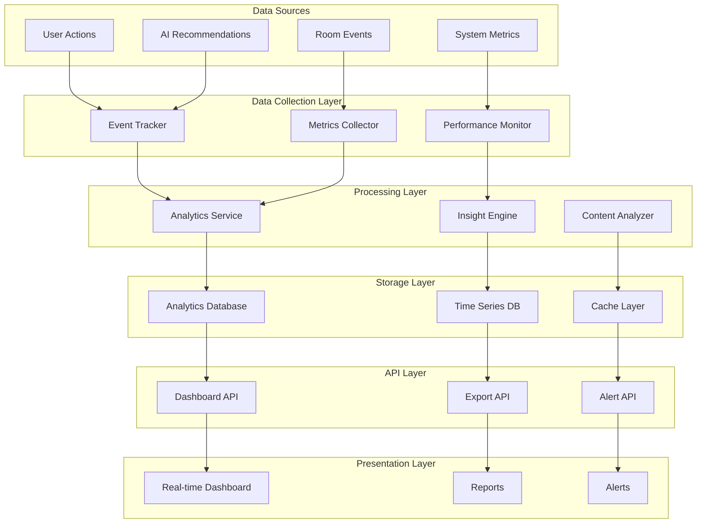

# Analytics System - Design Specification

## Overview

The Trinity Analytics System is designed as a comprehensive data collection, processing, and visualization platform that provides real-time insights into user behavior, room performance, and content preferences. The system follows an event-driven architecture with real-time processing capabilities and scalable data storage.

## Architecture

### High-Level Architecture



### Component Architecture

#### 1. Event Collection System
```typescript
interface EventTracker {
  trackUserAction(userId: string, action: UserAction): Promise<void>;
  trackRoomEvent(roomId: string, event: RoomEvent): Promise<void>;
  trackSystemEvent(event: SystemEvent): Promise<void>;
  batchTrackEvents(events: AnalyticsEvent[]): Promise<void>;
}

interface AnalyticsEvent {
  eventId: string;
  eventType: EventType;
  timestamp: Date;
  userId?: string;
  roomId?: string;
  sessionId: string;
  properties: Record<string, any>;
  context: EventContext;
}
```

#### 2. Metrics Processing Engine
```typescript
interface MetricsCollector {
  aggregateUserMetrics(timeRange: TimeRange): Promise<UserMetrics>;
  aggregateRoomMetrics(roomId?: string): Promise<RoomMetrics>;
  aggregateContentMetrics(contentId?: string): Promise<ContentMetrics>;
  generateRealTimeMetrics(): Promise<RealTimeMetrics>;
}

interface UserMetrics {
  activeUsers: {
    daily: number;
    weekly: number;
    monthly: number;
  };
  sessionMetrics: {
    averageDuration: number;
    actionsPerSession: number;
    bounceRate: number;
  };
  engagementMetrics: {
    votesPerUser: number;
    roomsJoined: number;
    matchesFound: number;
  };
}
```

#### 3. Analytics Data Models
```typescript
interface RoomMetrics {
  roomId: string;
  performanceMetrics: {
    consensusRate: number;
    averageTimeToConsensus: number;
    memberParticipationRate: number;
    dropoutRate: number;
  };
  contentMetrics: {
    votesPerMatch: number;
    contentDiscoveryRate: number;
    genreDistribution: Record<string, number>;
  };
  memberMetrics: {
    averageMemberCount: number;
    optimalMemberCount: number;
    memberSatisfactionScore: number;
  };
}

interface ContentMetrics {
  contentId: string;
  performanceMetrics: {
    totalVotes: number;
    positiveVoteRate: number;
    matchSuccessRate: number;
    averageRating: number;
  };
  demographicMetrics: {
    ageGroupPreferences: Record<string, number>;
    genrePopularity: Record<string, number>;
    timeOfDayPreferences: Record<string, number>;
  };
  recommendationMetrics: {
    aiRecommendationRate: number;
    recommendationAcceptanceRate: number;
    semanticSimilarityScore: number;
  };
}
```

## Components and Interfaces

### 1. Analytics Service

```typescript
@Injectable()
export class AnalyticsService {
  // User Analytics
  async getUserBehaviorAnalytics(
    userId?: string,
    timeRange?: TimeRange
  ): Promise<UserBehaviorAnalytics>;
  
  async getUserRetentionMetrics(
    cohortDate: Date
  ): Promise<RetentionMetrics>;
  
  async getUserSegmentAnalysis(
    segmentCriteria: SegmentCriteria
  ): Promise<UserSegmentAnalytics>;
  
  // Room Analytics
  async getRoomPerformanceAnalytics(
    roomId?: string,
    timeRange?: TimeRange
  ): Promise<RoomPerformanceAnalytics>;
  
  async getRoomOptimizationInsights(
    roomId: string
  ): Promise<RoomOptimizationInsights>;
  
  // Content Analytics
  async getContentPreferenceAnalytics(
    userId?: string,
    timeRange?: TimeRange
  ): Promise<ContentPreferenceAnalytics>;
  
  async getContentPerformanceMetrics(
    contentId?: string
  ): Promise<ContentPerformanceMetrics>;
  
  // System Analytics
  async getSystemPerformanceMetrics(
    timeRange?: TimeRange
  ): Promise<SystemPerformanceMetrics>;
  
  async generateInsights(
    analysisType: AnalysisType
  ): Promise<AnalyticsInsights>;
}
```

### 2. Dashboard API Controller

```typescript
@Controller('analytics')
@UseGuards(JwtAuthGuard)
export class AnalyticsController {
  @Get('dashboard/overview')
  async getDashboardOverview(
    @Query() filters: DashboardFilters
  ): Promise<DashboardOverview>;
  
  @Get('users/behavior')
  async getUserBehaviorMetrics(
    @Query() query: UserAnalyticsQuery
  ): Promise<UserBehaviorMetrics>;
  
  @Get('rooms/performance')
  async getRoomPerformanceMetrics(
    @Query() query: RoomAnalyticsQuery
  ): Promise<RoomPerformanceMetrics>;
  
  @Get('content/preferences')
  async getContentPreferenceMetrics(
    @Query() query: ContentAnalyticsQuery
  ): Promise<ContentPreferenceMetrics>;
  
  @Get('system/performance')
  async getSystemPerformanceMetrics(
    @Query() query: SystemAnalyticsQuery
  ): Promise<SystemPerformanceMetrics>;
  
  @Get('insights/predictions')
  async getPredictiveInsights(
    @Query() query: PredictiveAnalyticsQuery
  ): Promise<PredictiveInsights>;
  
  @Post('export')
  async exportAnalyticsData(
    @Body() exportRequest: ExportRequest
  ): Promise<ExportResponse>;
  
  @Get('alerts/active')
  async getActiveAlerts(): Promise<AnalyticsAlert[]>;
  
  @Post('alerts/configure')
  async configureAlert(
    @Body() alertConfig: AlertConfiguration
  ): Promise<AlertConfiguration>;
}
```

### 3. Event Tracking System

```typescript
@Injectable()
export class EventTracker {
  async trackEvent(event: AnalyticsEvent): Promise<void>;
  
  async trackUserAction(
    userId: string,
    action: UserActionType,
    context: ActionContext
  ): Promise<void>;
  
  async trackRoomEvent(
    roomId: string,
    event: RoomEventType,
    context: RoomEventContext
  ): Promise<void>;
  
  async trackSystemMetric(
    metric: SystemMetric
  ): Promise<void>;
  
  async batchTrackEvents(
    events: AnalyticsEvent[]
  ): Promise<BatchTrackingResult>;
}

enum UserActionType {
  LOGIN = 'user_login',
  LOGOUT = 'user_logout',
  JOIN_ROOM = 'join_room',
  LEAVE_ROOM = 'leave_room',
  VOTE_CONTENT = 'vote_content',
  REQUEST_AI_RECOMMENDATION = 'request_ai_recommendation',
  VIEW_MATCH = 'view_match',
  SHARE_CONTENT = 'share_content'
}

enum RoomEventType {
  ROOM_CREATED = 'room_created',
  ROOM_STARTED = 'room_started',
  ROOM_PAUSED = 'room_paused',
  ROOM_COMPLETED = 'room_completed',
  MATCH_FOUND = 'match_found',
  CONSENSUS_ACHIEVED = 'consensus_achieved',
  MEMBER_INACTIVE = 'member_inactive'
}
```

## Data Models

### Analytics Database Schema

#### 1. Events Table (Time-Series)
```typescript
interface AnalyticsEvent {
  eventId: string;           // PK
  timestamp: Date;           // SK (for time-series queries)
  eventType: EventType;
  userId?: string;
  roomId?: string;
  sessionId: string;
  properties: Record<string, any>;
  context: {
    userAgent?: string;
    ipAddress?: string;
    deviceType?: string;
    platform?: string;
  };
  processed: boolean;
  ttl?: number;             // Auto-expire old events
}
```

#### 2. User Analytics Table
```typescript
interface UserAnalytics {
  userId: string;           // PK
  date: string;            // SK (YYYY-MM-DD)
  sessionCount: number;
  totalSessionDuration: number;
  actionsPerformed: number;
  roomsJoined: number;
  votesSubmitted: number;
  matchesFound: number;
  aiRecommendationsRequested: number;
  lastActiveAt: Date;
  deviceTypes: string[];
  preferredGenres: string[];
}
```

#### 3. Room Analytics Table
```typescript
interface RoomAnalytics {
  roomId: string;          // PK
  date: string;           // SK (YYYY-MM-DD)
  memberCount: number;
  totalVotes: number;
  matchesFound: number;
  consensusRate: number;
  averageTimeToConsensus: number;
  dropoutRate: number;
  contentCategories: Record<string, number>;
  memberSatisfactionScore: number;
  aiRecommendationUsage: number;
}
```

#### 4. Content Analytics Table
```typescript
interface ContentAnalytics {
  contentId: string;       // PK
  date: string;           // SK (YYYY-MM-DD)
  totalViews: number;
  totalVotes: number;
  positiveVotes: number;
  negativeVotes: number;
  matchCount: number;
  averageRating: number;
  genreCategory: string;
  releaseYear: number;
  aiRecommendationSource: boolean;
  demographicBreakdown: Record<string, number>;
}
```

#### 5. System Metrics Table
```typescript
interface SystemMetrics {
  metricType: string;      // PK (e.g., 'api_performance', 'resource_usage')
  timestamp: Date;         // SK
  value: number;
  unit: string;
  tags: Record<string, string>;
  threshold?: number;
  alertLevel?: 'info' | 'warning' | 'critical';
}
```

## Correctness Properties

*A property is a characteristic or behavior that should hold true across all valid executions of a system—essentially, a formal statement about what the system should do. Properties serve as the bridge between human-readable specifications and machine-verifiable correctness guarantees.*

### Property 1: Event Tracking Completeness
*For any* user action performed in the system, the Event_Tracker should successfully record the event with all required metadata and context information.
**Validates: Requirements 1.1, 1.3, 1.4**

### Property 2: Metrics Aggregation Consistency
*For any* time period and user segment, aggregated metrics should be mathematically consistent with the underlying event data and sum correctly across all dimensions.
**Validates: Requirements 1.2, 1.5, 2.4**

### Property 3: Real-time Data Freshness
*For any* analytics query requesting real-time data, the returned metrics should reflect events that occurred within the last 60 seconds with sub-minute latency.
**Validates: Requirements 5.1, 9.2**

### Property 4: Data Privacy Compliance
*For any* analytics data export or API response, personally identifiable information should be properly anonymized and individual users should not be identifiable from aggregated data.
**Validates: Requirements 6.1, 6.5**

### Property 5: Performance Scalability
*For any* analytics processing load up to 10,000 events per minute, the system should maintain response times under 5 seconds for standard queries and successfully process all events without data loss.
**Validates: Requirements 9.1, 9.2**

### Property 6: Alert Threshold Accuracy
*For any* configured alert threshold, when metrics exceed the threshold value, the system should trigger alerts within 2 minutes and provide accurate context about the threshold breach.
**Validates: Requirements 10.1, 10.2**

### Property 7: Data Retention Compliance
*For any* analytics data older than the configured retention period, the system should automatically remove the data while maintaining referential integrity of aggregated metrics.
**Validates: Requirements 6.2, 6.3**

### Property 8: Export Data Integrity
*For any* data export request, the exported data should be complete, accurate, and maintain the same statistical properties as the source data across all requested dimensions.
**Validates: Requirements 8.2, 8.4**

### Property 9: Insight Generation Accuracy
*For any* predictive analytics calculation, the generated insights should be based on statistically significant data samples and include confidence intervals that accurately reflect the prediction reliability.
**Validates: Requirements 7.1, 7.6**

### Property 10: API Rate Limiting Consistency
*For any* client making API requests, the rate limiting should be consistently applied across all endpoints and provide clear feedback when limits are exceeded without affecting other clients.
**Validates: Requirements 8.5, 9.5**

## Error Handling

### Error Categories and Responses

#### 1. Data Collection Errors
- **Event Validation Failures**: Return 400 Bad Request with detailed validation errors
- **Storage Failures**: Implement retry logic with exponential backoff
- **Rate Limiting**: Return 429 Too Many Requests with retry-after header

#### 2. Processing Errors
- **Aggregation Failures**: Log errors and use cached results when available
- **Insight Generation Errors**: Provide fallback to basic metrics
- **Performance Degradation**: Implement circuit breaker pattern

#### 3. API Errors
- **Authentication Failures**: Return 401 Unauthorized
- **Authorization Failures**: Return 403 Forbidden
- **Resource Not Found**: Return 404 Not Found with helpful error messages
- **Server Errors**: Return 500 Internal Server Error with correlation ID

### Error Recovery Strategies

#### 1. Data Recovery
```typescript
interface DataRecoveryService {
  recoverLostEvents(timeRange: TimeRange): Promise<RecoveryResult>;
  validateDataIntegrity(dataset: string): Promise<IntegrityReport>;
  repairCorruptedMetrics(metricType: string): Promise<RepairResult>;
}
```

#### 2. Graceful Degradation
- Serve cached results when real-time processing fails
- Provide approximate metrics when exact calculations are unavailable
- Disable non-essential features during high load

## Testing Strategy

### Unit Testing
- Test individual analytics calculations and aggregations
- Validate event tracking and data transformation logic
- Test error handling and edge cases
- Mock external dependencies (database, cache)

### Property-Based Testing
- **Event Processing**: Verify that all events are processed correctly regardless of order or volume
- **Metric Calculations**: Ensure mathematical consistency across different aggregation methods
- **Data Privacy**: Validate that anonymization works correctly for all data types
- **Performance**: Test system behavior under various load conditions
- **Alert Logic**: Verify alert triggering accuracy across different threshold configurations

### Integration Testing
- Test end-to-end analytics workflows
- Validate API responses and data formats
- Test real-time data pipeline functionality
- Verify dashboard data accuracy

### Performance Testing
- Load testing with high event volumes (10,000+ events/minute)
- Stress testing dashboard API with concurrent users
- Memory and CPU usage optimization validation
- Database query performance optimization

Each property test should run a minimum of 100 iterations to ensure comprehensive coverage of edge cases and data variations. Tests should be tagged with: **Feature: analytics-system, Property {number}: {property_text}**