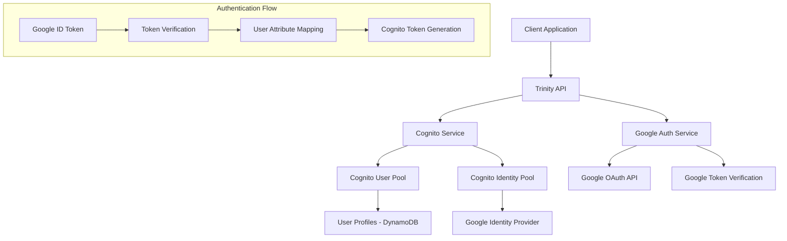
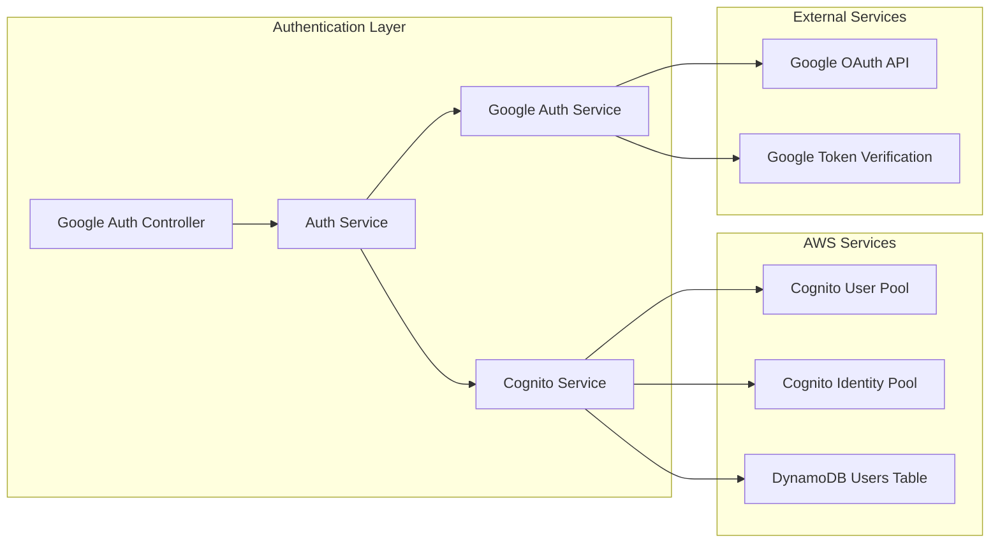

# Design Document: Google Authentication through AWS Cognito

## Overview

This design implements a comprehensive Google authentication system fully integrated with AWS Cognito using Identity Pools and federated identity providers. The system enables users to authenticate using their Google accounts while maintaining centralized user management through Cognito, providing seamless token exchange, profile synchronization, and multi-provider authentication support.

The architecture leverages AWS Cognito's federated identity capabilities to handle Google OAuth flow, token validation, and user attribute mapping, ensuring security, scalability, and compliance with AWS best practices.

## Architecture

### High-Level Architecture



### Component Architecture



## Components and Interfaces

### 1. Enhanced Cognito Service

**Purpose**: Manage federated authentication with Google through Cognito Identity Pool

**Key Methods**:
```typescript
interface CognitoFederatedService {
  // Federated Authentication
  authenticateWithGoogle(googleIdToken: string): Promise<CognitoTokens>;
  linkGoogleProvider(userId: string, googleIdToken: string): Promise<void>;
  unlinkGoogleProvider(userId: string): Promise<void>;
  
  // Identity Pool Management
  configureGoogleProvider(): Promise<void>;
  validateProviderConfiguration(): boolean;
  
  // Token Management
  exchangeGoogleTokenForCognito(googleToken: string): Promise<CognitoTokens>;
  refreshFederatedTokens(refreshToken: string): Promise<CognitoTokens>;
}
```

### 2. Google Authentication Service

**Purpose**: Handle Google-specific authentication logic and token verification

**Key Methods**:
```typescript
interface GoogleAuthService {
  // Token Verification
  verifyGoogleIdToken(idToken: string): Promise<GoogleUserInfo>;
  validateTokenAudience(token: string): boolean;
  checkTokenExpiration(token: string): boolean;
  
  // User Management
  createFederatedUser(googleUser: GoogleUserInfo): Promise<CognitoUser>;
  updateUserFromGoogle(userId: string, googleUser: GoogleUserInfo): Promise<void>;
  mapGoogleAttributesToCognito(googleUser: GoogleUserInfo): CognitoUserAttributes;
}
```

### 3. Federated Auth Controller

**Purpose**: Expose REST endpoints for Google authentication

**Endpoints**:
```typescript
interface GoogleAuthEndpoints {
  // Authentication
  POST /api/auth/google/authenticate
  POST /api/auth/google/link
  DELETE /api/auth/google/unlink
  
  // Status and Configuration
  GET /api/auth/google/status
  GET /api/auth/google/availability
  POST /api/auth/google/refresh
}
```

### 4. User Profile Synchronization Service

**Purpose**: Synchronize user profiles between Google and Cognito

**Key Methods**:
```typescript
interface ProfileSyncService {
  syncProfileFromGoogle(userId: string, googleProfile: GoogleUserInfo): Promise<void>;
  mergeProviderAttributes(cognitoUser: CognitoUser, googleUser: GoogleUserInfo): CognitoUser;
  handleAttributeConflicts(existing: any, incoming: any): any;
}
```

## Data Models

### Google User Information
```typescript
interface GoogleUserInfo {
  sub: string;                    // Google user ID
  email: string;                  // User email
  email_verified: boolean;        // Email verification status
  name: string;                   // Full name
  given_name?: string;           // First name
  family_name?: string;          // Last name
  picture?: string;              // Profile picture URL
  locale?: string;               // User locale
  hd?: string;                   // Hosted domain (for G Suite)
}
```

### Cognito Federated User
```typescript
interface CognitoFederatedUser {
  // Cognito Standard Attributes
  sub: string;                    // Cognito user ID
  email: string;
  email_verified: boolean;
  name: string;
  given_name?: string;
  family_name?: string;
  picture?: string;
  
  // Custom Attributes
  'custom:google_id': string;     // Google user ID
  'custom:auth_providers': string[]; // ['google', 'email']
  'custom:last_google_sync': string; // ISO timestamp
  'custom:google_hd'?: string;    // Hosted domain
}
```

### Authentication Response
```typescript
interface GoogleAuthResponse {
  success: boolean;
  user: {
    id: string;
    email: string;
    name: string;
    picture?: string;
    emailVerified: boolean;
    authProviders: string[];
    isGoogleLinked: boolean;
  };
  tokens: {
    accessToken: string;          // Cognito access token
    idToken: string;              // Cognito ID token
    refreshToken: string;         // Cognito refresh token
    expiresIn: number;           // Token expiration time
  };
  metadata: {
    provider: 'google';
    federatedAt: string;         // ISO timestamp
    tokenSource: 'cognito';
  };
}
```

## Correctness Properties

*A property is a characteristic or behavior that should hold true across all valid executions of a system-essentially, a formal statement about what the system should do. Properties serve as the bridge between human-readable specifications and machine-verifiable correctness guarantees.*

### Property 1: Configuration Validation
*For any* system initialization, if Google provider configuration is present, then Google authentication should be enabled and available
**Validates: Requirements 1.1, 1.3**

### Property 2: Configuration Error Handling
*For any* system initialization with missing or invalid Google configuration, the system should disable Google auth and log appropriate warnings
**Validates: Requirements 1.2**

### Property 3: Token Verification Consistency
*For any* Google ID token provided to the system, the token verification result should be consistent with Google's verification API
**Validates: Requirements 2.1, 4.1, 9.1**

### Property 4: User Information Extraction
*For any* valid Google ID token, the extracted user information should contain all required fields (email, name) and match the token payload
**Validates: Requirements 2.2**

### Property 5: New User Creation
*For any* valid Google token from a non-existing user, the system should create a new federated user in Cognito with properly mapped attributes
**Validates: Requirements 2.3, 2.4**

### Property 6: Authentication Token Response
*For any* successful Google authentication, the system should return valid Cognito tokens (access, id, refresh) with proper expiration
**Validates: Requirements 2.5, 3.2**

### Property 7: Existing User Authentication
*For any* existing Google user with valid token, authentication should succeed and return valid Cognito tokens
**Validates: Requirements 3.1**

### Property 8: Profile Synchronization
*For any* Google authentication where user information has changed, the user profile in Cognito should be updated to reflect the changes
**Validates: Requirements 3.3, 7.1**

### Property 9: Account Linking Validation
*For any* Google account not linked to another user, linking to an authenticated user should succeed and update authentication providers
**Validates: Requirements 4.2**

### Property 10: Duplicate Linking Prevention
*For any* Google account already linked to a user, attempting to link it to another user should fail with appropriate error
**Validates: Requirements 4.3**

### Property 11: Unlinking Safety Check
*For any* user with only Google authentication, attempting to unlink Google should fail and return an error
**Validates: Requirements 5.2**

### Property 12: Safe Unlinking
*For any* user with multiple authentication methods, unlinking Google should succeed and remove Google from authentication providers
**Validates: Requirements 5.3**

### Property 13: Token Exchange
*For any* successful Google authentication, the system should exchange Google tokens for equivalent Cognito tokens
**Validates: Requirements 6.1**

### Property 14: Attribute Mapping Consistency
*For any* Google user profile, the mapping to Cognito attributes should preserve all essential information (email, name, picture)
**Validates: Requirements 7.2**

### Property 15: Invalid Token Rejection
*For any* invalid or expired Google token, the system should reject authentication and return a clear error message
**Validates: Requirements 8.1, 9.3**

### Property 16: Email Conflict Handling
*For any* Google authentication where email conflicts with existing user, the system should handle the conflict appropriately
**Validates: Requirements 8.3**

### Property 17: Audience Validation
*For any* Google ID token, the system should verify the token audience matches the configured client ID
**Validates: Requirements 9.2**

### Property 18: Authentication Event Logging
*For any* authentication attempt (successful or failed), the system should log appropriate events for monitoring
**Validates: Requirements 10.2**

## Error Handling

### Error Categories

1. **Configuration Errors**
   - Missing Google client ID/secret
   - Invalid Cognito Identity Pool configuration
   - Provider configuration mismatch

2. **Authentication Errors**
   - Invalid Google ID token
   - Expired token
   - Token audience mismatch
   - Google service unavailable

3. **User Management Errors**
   - Email conflicts
   - Account already linked
   - Cannot unlink (only auth method)
   - Profile synchronization failures

4. **Token Management Errors**
   - Token exchange failures
   - Refresh token invalid
   - Cognito service errors

### Error Response Format
```typescript
interface AuthError {
  error: string;
  message: string;
  code: string;
  details?: {
    provider: 'google' | 'cognito';
    operation: string;
    timestamp: string;
  };
}
```

## Testing Strategy

### Unit Testing
- **Configuration validation**: Test provider setup and validation logic
- **Token verification**: Test Google token validation with various token states
- **User mapping**: Test attribute mapping between Google and Cognito
- **Error handling**: Test all error scenarios with appropriate responses
- **Edge cases**: Test email conflicts, duplicate linking, unlinking safety

### Property-Based Testing
- **Token validation properties**: Test token verification across many valid/invalid tokens
- **User creation properties**: Test user creation with various Google profiles
- **Authentication flow properties**: Test complete authentication flows with random inputs
- **Attribute mapping properties**: Test profile mapping with diverse user data
- **Security properties**: Test security validations across many token variations

### Integration Testing
- **Google API integration**: Test actual Google token verification
- **Cognito integration**: Test federated authentication with Cognito
- **End-to-end flows**: Test complete authentication scenarios
- **Error recovery**: Test system behavior during service outages

### Configuration Requirements
- Minimum 100 iterations per property test
- Each property test tagged with: **Feature: google-cognito-auth, Property {number}: {property_text}**
- Use fast-check or similar property testing library for TypeScript
- Mock external services (Google API) for unit tests, use real services for integration tests