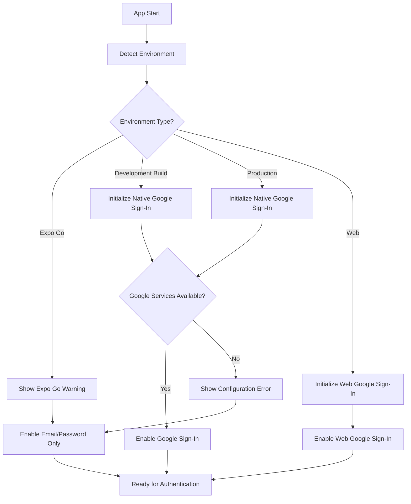
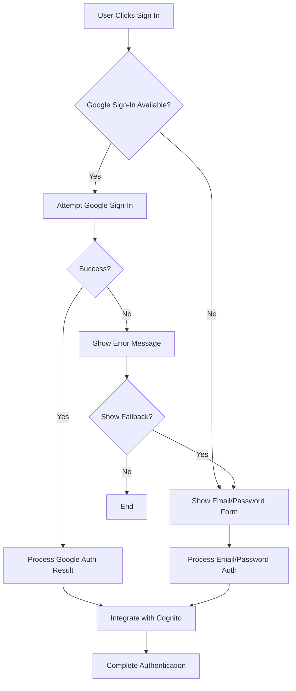

# Design Document - Google Sign-In Mobile Fix

## Resumen Ejecutivo

Este documento describe el diseño técnico para implementar Google Sign-In completo en la aplicación móvil Trinity, manejando las limitaciones de Expo Go y proporcionando fallbacks apropiados para diferentes entornos de ejecución.

## Arquitectura de Solución

### 1. Detección de Entorno

```typescript
interface EnvironmentInfo {
  platform: 'ios' | 'android' | 'web';
  runtime: 'expo-go' | 'development-build' | 'production' | 'web';
  googleSignInAvailable: boolean;
  hasGoogleServicesFile: boolean;
}
```

**Componentes:**
- `EnvironmentDetector`: Servicio para detectar el entorno actual
- `GoogleSignInCapabilityChecker`: Validador de capacidades de Google Sign-In
- `ConfigurationValidator`: Validador de archivos de configuración

### 2. Gestión de Configuración

**Archivos de Configuración:**
- `google-services.json` (Android) - Ubicación: `android/app/`
- `GoogleService-Info.plist` (iOS) - Ubicación: `ios/`
- `app.json` - Configuración de plugins de Expo

**Estructura de Configuración:**
```typescript
interface GoogleSignInConfig {
  webClientId: string;
  iosClientId?: string;
  androidClientId?: string;
  scopes: string[];
  offlineAccess: boolean;
}
```

### 3. Servicio de Autenticación Adaptativo

```typescript
interface AuthenticationStrategy {
  isAvailable(): Promise<boolean>;
  signIn(): Promise<AuthResult>;
  signOut(): Promise<void>;
  getCurrentUser(): Promise<User | null>;
}
```

**Estrategias de Implementación:**
1. **NativeGoogleSignIn**: Para Development Builds y Production
2. **WebGoogleSignIn**: Para entorno web
3. **FallbackEmailAuth**: Para Expo Go y casos de error

### 4. Sistema de Fallback Inteligente

**Cascada de Autenticación:**
1. Detectar entorno y capacidades
2. Intentar Google Sign-In nativo (si disponible)
3. Fallback a Google Sign-In web (si en navegador)
4. Fallback a autenticación email/password (siempre disponible)

## Componentes Técnicos

### 1. Environment Detection Service

**Archivo:** `mobile/src/services/environmentService.ts`

```typescript
class EnvironmentService {
  async detectEnvironment(): Promise<EnvironmentInfo>
  isExpoGo(): boolean
  isDevelopmentBuild(): boolean
  isProduction(): boolean
  isWeb(): boolean
  validateGoogleServicesConfiguration(): Promise<ValidationResult>
}
```

**Responsabilidades:**
- Detectar el entorno de ejecución actual
- Validar la presencia de archivos de configuración
- Determinar capacidades disponibles de Google Sign-In

### 2. Google Sign-In Manager

**Archivo:** `mobile/src/services/googleSignInManager.ts`

```typescript
class GoogleSignInManager {
  async initialize(): Promise<void>
  async signIn(): Promise<AuthResult>
  async signOut(): Promise<void>
  isAvailable(): boolean
  getStrategy(): AuthenticationStrategy
}
```

**Responsabilidades:**
- Gestionar diferentes estrategias de autenticación
- Proporcionar interfaz unificada para Google Sign-In
- Manejar errores y fallbacks automáticamente

### 3. Configuration Validator

**Archivo:** `mobile/src/services/configurationValidator.ts`

```typescript
class ConfigurationValidator {
  validateGoogleServicesJson(): ValidationResult
  validateGoogleServicesPlist(): ValidationResult
  validateAppJsonConfiguration(): ValidationResult
  generateConfigurationReport(): ConfigurationReport
}
```

**Responsabilidades:**
- Validar archivos de configuración de Google Services
- Proporcionar diagnósticos detallados
- Generar reportes de configuración

### 4. Enhanced Auth Context

**Archivo:** `mobile/src/context/EnhancedAuthContext.tsx`

Extensión del contexto existente para incluir:
- Detección automática de capacidades
- Gestión de múltiples proveedores de autenticación
- Estado de configuración y diagnósticos

## Flujos de Usuario

### 1. Flujo de Inicialización



### 2. Flujo de Autenticación



## Configuración de Build

### 1. EAS Build Configuration

**Archivo:** `eas.json`

```json
{
  "build": {
    "development": {
      "developmentClient": true,
      "distribution": "internal",
      "android": {
        "buildType": "apk"
      }
    },
    "preview": {
      "distribution": "internal",
      "android": {
        "buildType": "apk"
      }
    },
    "production": {
      "android": {
        "buildType": "aab"
      }
    }
  }
}
```

### 2. App Configuration

**Archivo:** `app.json` (actualizaciones)

```json
{
  "expo": {
    "plugins": [
      "@react-native-google-signin/google-signin",
      [
        "expo-build-properties",
        {
          "android": {
            "googleServicesFile": "./google-services.json"
          },
          "ios": {
            "googleServicesFile": "./GoogleService-Info.plist"
          }
        }
      ]
    ]
  }
}
```

## Testing Strategy

### 1. Environment Testing Matrix

| Entorno | Google Sign-In | Email/Password | Notas |
|---------|----------------|----------------|-------|
| Expo Go | ❌ | ✅ | Mostrar warning |
| Development Build | ✅ | ✅ | Testing completo |
| Production Build | ✅ | ✅ | Funcionalidad completa |
| Web Browser | ✅ (Web) | ✅ | Google Sign-In web |

### 2. Test Cases

**Archivo:** `mobile/src/tests/googleSignInIntegration.test.ts`

```typescript
describe('Google Sign-In Integration', () => {
  test('should detect Expo Go environment correctly')
  test('should fallback to email auth in Expo Go')
  test('should initialize native Google Sign-In in development build')
  test('should handle missing configuration files gracefully')
  test('should provide clear error messages for configuration issues')
  test('should integrate Google auth with Cognito correctly')
})
```

## Documentation Structure

### 1. Setup Guide

**Archivo:** `mobile/GOOGLE_SIGNIN_SETUP.md`

Contenido:
- Configuración de Firebase Console
- Obtención de archivos de configuración
- Configuración de EAS Build
- Instrucciones específicas por plataforma

### 2. Troubleshooting Guide

**Archivo:** `mobile/GOOGLE_SIGNIN_TROUBLESHOOTING.md`

Contenido:
- Problemas comunes y soluciones
- Diagnóstico de configuración
- Diferencias entre entornos
- Logs de debugging

### 3. Testing Guide

**Archivo:** `mobile/GOOGLE_SIGNIN_TESTING.md`

Contenido:
- Estrategias de testing por entorno
- Creación de Development Builds
- Validación de configuración
- Test de integración

## Métricas y Monitoreo

### 1. Analytics Events

```typescript
interface GoogleSignInAnalytics {
  google_signin_attempt: {
    environment: string;
    strategy: string;
    success: boolean;
  };
  google_signin_fallback: {
    reason: string;
    fallback_method: string;
  };
  configuration_error: {
    error_type: string;
    environment: string;
  };
}
```

### 2. Error Tracking

- Errores de configuración
- Fallos de autenticación
- Problemas de entorno
- Métricas de fallback

## Security Considerations

### 1. Configuration Security

- Archivos de configuración no deben contener secretos
- Validación de certificados en production
- Rotación de claves de API

### 2. Authentication Security

- Validación de tokens de Google
- Integración segura con Cognito
- Manejo seguro de credenciales temporales

## Implementation Phases

### Phase 1: Environment Detection and Configuration
- Implementar detección de entorno
- Crear validador de configuración
- Configurar archivos de Google Services

### Phase 2: Authentication Strategies
- Implementar estrategias de autenticación
- Crear sistema de fallback
- Integrar con contexto de autenticación existente

### Phase 3: Build Configuration and Testing
- Configurar EAS Build
- Crear Development Builds
- Implementar tests de integración

### Phase 4: Documentation and Validation
- Crear guías de configuración
- Documentar troubleshooting
- Validar en todos los entornos

## Success Criteria

1. ✅ Google Sign-In funciona en Development Builds y Production
2. ✅ Fallback apropiado en Expo Go con mensajes claros
3. ✅ Configuración automática detecta problemas y proporciona soluciones
4. ✅ Documentación completa para setup y troubleshooting
5. ✅ Tests cubren todos los entornos y casos de error
6. ✅ Integración perfecta con sistema de autenticación Cognito existente
7. ✅ Experiencia de usuario consistente en todos los entornos