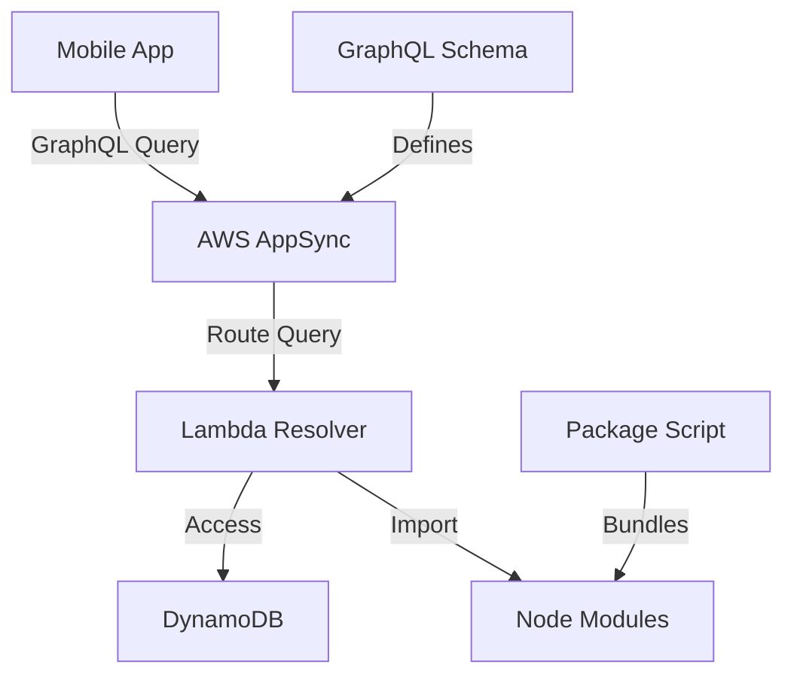

# Design Document: GraphQL Errors Fix

## Overview

This design addresses critical GraphQL and dependency errors in the Trinity application. The solution involves updating the GraphQL schema, fixing Lambda dependencies, and ensuring proper module resolution across the serverless infrastructure.

## Architecture

The fix involves three main components:
1. **GraphQL Schema Updates**: Add missing query definitions to the AppSync schema
2. **Lambda Dependency Resolution**: Ensure all Lambda functions have proper dependencies packaged
3. **Schema-Resolver Synchronization**: Align GraphQL schema with actual resolver implementations



## Components and Interfaces

### GraphQL Schema Component
- **Location**: `infrastructure/schema.graphql`
- **Purpose**: Define all available GraphQL operations
- **Interface**: GraphQL SDL (Schema Definition Language)
- **Key Operations**:
  - `getUserRooms`: Query to get user's room history
  - Proper type definitions for Room objects
  - Input/output type validation

### Lambda Packaging Component
- **Location**: `infrastructure/package-lambda.js`
- **Purpose**: Create deployment packages with all dependencies
- **Interface**: Node.js script with file system operations
- **Key Functions**:
  - Copy source files to temporary directory
  - Install production dependencies
  - Create zip archive with all modules
  - Validate package contents

### Resolver Functions Component
- **Location**: `infrastructure/lib/handlers/room.js`
- **Purpose**: Handle GraphQL operations
- **Interface**: AWS Lambda handler function
- **Key Operations**:
  - Process getUserRooms requests
  - Return properly formatted GraphQL responses
  - Handle errors gracefully

## Data Models

### GraphQL Schema Types
```graphql
type Room {
  id: ID!
  name: String!
  description: String
  status: RoomStatus!
  hostId: String!
  inviteCode: String!
  isActive: Boolean!
  isPrivate: Boolean!
  memberCount: Int!
  maxMembers: Int
  createdAt: AWSDateTime!
  updatedAt: AWSDateTime!
}

type Query {
  getUserRooms: [Room!]!
  getRoom(roomId: ID!): Room
  # ... other existing queries
}
```

### Lambda Package Structure
```
lambda-package/
├── room.js (main handler)
├── utils/
│   └── metrics.js
├── node_modules/
│   ├── uuid/
│   ├── @aws-sdk/
│   └── ... (all dependencies)
└── package.json
```

## Error Handling

### GraphQL Validation Errors
- **Detection**: AppSync validates queries against schema
- **Resolution**: Add missing field definitions to schema
- **Fallback**: Return meaningful error messages to client

### Module Resolution Errors
- **Detection**: Lambda runtime cannot find required modules
- **Resolution**: Ensure all dependencies are in deployment package
- **Fallback**: Package validation before deployment

### Dependency Missing Errors
- **Detection**: Import statements fail at runtime
- **Resolution**: Include all required packages in Lambda bundle
- **Fallback**: Verify package contents after creation

## Correctness Properties

*A property is a characteristic or behavior that should hold true across all valid executions of a system-essentially, a formal statement about what the system should do. Properties serve as the bridge between human-readable specifications and machine-verifiable correctness guarantees.*

### Property 1: Schema Field Existence
*For any* required GraphQL query field (like getUserRooms), the GraphQL schema should contain the field definition with proper types
**Validates: Requirements 1.1, 1.4, 1.5**

### Property 2: Lambda Request Handling
*For any* valid GraphQL request to getUserRooms, the Lambda function should process it without validation errors
**Validates: Requirements 1.3**

### Property 3: Lambda Package Completeness
*For any* Lambda deployment package created, all required dependencies (including uuid, AWS SDK, and peer dependencies) should be included in the package
**Validates: Requirements 2.1, 2.2, 2.3, 4.2, 4.3, 4.5**

### Property 4: Import Statement Correctness
*For any* Lambda function code, all import/require statements should use correct paths and be compatible with Node.js runtime
**Validates: Requirements 2.4, 4.1, 4.4**

### Property 5: Schema-Resolver Consistency
*For any* GraphQL query defined in the schema, there should be a corresponding resolver implementation that handles the operation
**Validates: Requirements 3.1, 3.2**

### Property 6: GraphQL Operation Routing
*For any* GraphQL operation called, the system should route it to the correct resolver function
**Validates: Requirements 3.5**

### Property 7: Module Resolution
*For any* Lambda function execution, all imported modules should be resolvable from the deployment package
**Validates: Requirements 4.1, 4.3**

### Property 8: GraphQL Response Validation
*For any* valid GraphQL query execution, the system should return properly formatted responses without validation errors
**Validates: Requirements 5.1, 5.3**

### Property 9: Error Handling
*For any* invalid GraphQL input, the system should return meaningful error messages and handle errors gracefully
**Validates: Requirements 5.4**

### Property 10: Metrics Logging
*For any* completed GraphQL operation, the system should log success metrics for monitoring
**Validates: Requirements 5.5**

## Testing Strategy

### Unit Tests
- Test individual resolver functions with mock dependencies
- Validate GraphQL schema parsing and type checking
- Test Lambda package creation script with various scenarios
- Test specific examples of schema field definitions
- Test module import availability in Lambda environment

### Integration Tests
- Test GraphQL queries end-to-end from mobile app to Lambda
- Validate AppSync routing to correct resolvers
- Test Lambda function execution with real dependencies

### Property-Based Tests
Each correctness property will be implemented as a property-based test with minimum 100 iterations, tagged with the format: **Feature: graphql-errors-fix, Property {number}: {property_text}**

**Dual Testing Approach**: Both unit tests and property tests are required and complementary. Unit tests validate specific examples and edge cases, while property tests verify universal correctness across all inputs.