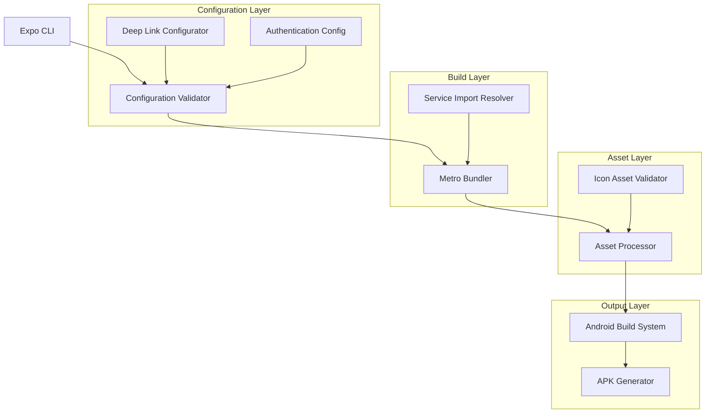

# Design Document: Mobile APK Build Fixes

## Overview

This design addresses systematic fixes for Trinity mobile app build failures, focusing on Expo configuration schema compliance, service import resolution, asset validation, and Android build optimization. The solution implements a multi-layered approach to ensure reliable APK generation while maintaining proper authentication integration and deep linking functionality.

## Architecture

### Build System Components



### Configuration Management Strategy

The design implements a configuration management strategy that separates concerns between:
- **Static Configuration**: Properties that remain constant across builds (app.json)
- **Dynamic Configuration**: Environment-specific settings (app.config.js)
- **Build-time Configuration**: EAS-specific settings (.easignore, eas.json)

## Components and Interfaces

### 1. Configuration Schema Validator

**Purpose**: Ensures app.json complies with Expo schema requirements for projects with native folders.

**Key Responsibilities**:
- Validates schema compliance for CNG (Continuous Native Generation) projects
- Handles property conflicts between app.json and native project folders
- Manages EAS ignore configuration for proper build behavior

**Implementation Strategy**:
- Move conflicting properties (`adaptiveIcon`, `linking`) to platform-specific sections
- Configure `.easignore` to exclude native folders when using Prebuild
- Implement schema validation checks before build initiation

### 2. Service Import Resolution System

**Purpose**: Resolves Metro bundler module resolution failures for service imports.

**Key Responsibilities**:
- Ensures all service dependencies are properly resolved
- Validates import paths and file existence
- Provides clear error messages for missing dependencies

**Implementation Strategy**:
- Verify all service files exist in expected locations
- Update import paths to use consistent relative path resolution
- Implement service dependency validation during build preparation

### 3. Asset Validation and Processing

**Purpose**: Ensures all app assets meet platform requirements for successful APK generation.

**Key Responsibilities**:
- Validates icon dimensions and format requirements
- Processes adaptive icons for Android compatibility
- Optimizes assets for mobile deployment

**Asset Requirements**:
- **App Icon**: Must be square (1:1 aspect ratio), minimum 1024x1024px
- **Adaptive Icon**: Foreground image with transparent background
- **Splash Screen**: Optimized for various screen densities

**Implementation Strategy**:
- Create square icon assets from existing logo
- Configure adaptive icon with proper foreground/background separation
- Implement asset validation pipeline

### 4. Android Build Configuration Manager

**Purpose**: Manages Android-specific build settings and dependencies.

**Key Responsibilities**:
- Configures proper SDK versions and build tools
- Manages package settings and permissions
- Handles Google Services integration

**Configuration Elements**:
- **Compile SDK Version**: 35 (Android 15)
- **Target SDK Version**: 35
- **Build Tools Version**: 35.0.0
- **Package Name**: com.trinity.app

### 5. Deep Link Configuration System

**Purpose**: Manages URL scheme and intent filter configuration for deep linking.

**Key Responsibilities**:
- Validates URL schemes and domain associations
- Configures Android intent filters
- Ensures proper routing configuration

**Deep Link Configuration**:
- **Custom Scheme**: `trinity://`
- **Universal Links**: `https://trinity.app`
- **Intent Filters**: Configured for VIEW actions with BROWSABLE category

### 6. Authentication Configuration Integration

**Purpose**: Ensures authentication services are properly configured for mobile deployment.

**Key Responsibilities**:
- Validates Cognito configuration values
- Manages Google Sign-In client ID configuration
- Ensures secure credential storage setup

**Authentication Elements**:
- **Cognito User Pool**: eu-west-1_6UxioIj4z
- **Cognito Client ID**: 59dpqsm580j14ulkcha19shl64
- **Google Client ID**: 230498169556-cqb6dv3o58oeblrfrk49o0a6l7ecjtrn.apps.googleusercontent.com

## Data Models

### Build Configuration Model

```typescript
interface BuildConfiguration {
  expo: {
    name: string;
    slug: string;
    version: string;
    icon: string; // Square icon path
    android: {
      package: string;
      compileSdkVersion: number;
      targetSdkVersion: number;
      buildToolsVersion: string;
      adaptiveIcon?: {
        foregroundImage: string;
        backgroundColor: string;
      };
      intentFilters: IntentFilter[];
    };
    plugins: Plugin[];
    extra: ExtraConfiguration;
  };
}

interface IntentFilter {
  action: string;
  autoVerify: boolean;
  data: DataFilter[];
  category: string[];
}

interface ExtraConfiguration {
  cognitoUserPoolId: string;
  cognitoClientId: string;
  cognitoRegion: string;
  googleWebClientId: string;
  googleAndroidClientId: string;
}
```

### Asset Validation Model

```typescript
interface AssetValidationResult {
  isValid: boolean;
  errors: AssetError[];
  warnings: AssetWarning[];
  optimizations: AssetOptimization[];
}

interface AssetError {
  type: 'DIMENSION' | 'FORMAT' | 'SIZE' | 'MISSING';
  message: string;
  file: string;
  expectedValue?: string;
  actualValue?: string;
}
```

### Service Import Model

```typescript
interface ServiceImportValidation {
  serviceName: string;
  importPath: string;
  exists: boolean;
  resolvedPath?: string;
  dependencies: string[];
  errors: ImportError[];
}

interface ImportError {
  type: 'MODULE_NOT_FOUND' | 'CIRCULAR_DEPENDENCY' | 'TYPE_ERROR';
  message: string;
  location: string;
}
```

## Correctness Properties

*A property is a characteristic or behavior that should hold true across all valid executions of a system-essentially, a formal statement about what the system should do. Properties serve as the bridge between human-readable specifications and machine-verifiable correctness guarantees.*

### Converting EARS to Properties

Based on the prework analysis, I'll convert the testable acceptance criteria into universally quantified properties:

**Property 1: Service Import Resolution**
*For any* valid service import configuration, the build system should successfully resolve all service dependencies without module resolution failures
**Validates: Requirements 1.1, 1.3**

**Property 2: Configuration Schema Validation**
*For any* properly formatted app.json configuration, the Expo build system should pass all schema validation checks and accept all configuration properties as valid
**Validates: Requirements 2.1, 2.2**

**Property 3: Configuration Error Handling**
*For any* invalid configuration property, the build system should provide specific guidance and clear error messages indicating how to fix each error
**Validates: Requirements 1.4, 2.3, 5.4**

**Property 4: Icon Asset Validation**
*For any* app icon asset, the asset validator should verify it meets platform requirements (square aspect ratio, proper format) and reject invalid icons with specific error messages
**Validates: Requirements 3.1, 3.4**

**Property 5: Adaptive Icon Processing**
*For any* valid adaptive icon configuration, the build system should properly process and include the icon assets in the generated APK for all required densities
**Validates: Requirements 3.2, 3.3**

**Property 6: Android Build Configuration**
*For any* valid Android build configuration, the APK generator should use correct SDK versions, build tools, and package settings to complete compilation without errors
**Validates: Requirements 4.1, 4.2, 4.3**

**Property 7: Build Configuration Error Handling**
*For any* invalid build configuration, the APK generator should provide specific error messages for each configuration issue
**Validates: Requirements 4.4**

**Property 8: Deep Link Configuration Validation**
*For any* deep link configuration, the build system should validate all URL schemes and domains, and include proper intent filters in the generated APK
**Validates: Requirements 5.1, 5.2**

**Property 9: Build Process Reliability**
*For any* valid complete configuration, the Expo build system should complete the build process without interruption and produce a valid APK file
**Validates: Requirements 6.1, 6.2**

**Property 10: Build Error Reporting**
*For any* build error condition, the Expo build system should provide actionable error messages and resolution steps
**Validates: Requirements 6.3**

**Property 11: Authentication Configuration Integration**
*For any* valid authentication configuration, the built app should include correct Cognito configuration values and valid Google Sign-In client IDs and URL schemes
**Validates: Requirements 7.1, 7.2**

**Property 12: Asset Optimization**
*For any* image asset, the asset validator should optimize images appropriately for mobile deployment while maintaining quality
**Validates: Requirements 8.2**

## Error Handling

### Configuration Error Recovery

The system implements a multi-level error handling strategy:

1. **Pre-build Validation**: Validates configuration before initiating build process
2. **Build-time Error Detection**: Catches errors during Metro bundling and compilation
3. **Post-build Verification**: Validates generated APK meets requirements

### Error Classification

- **Critical Errors**: Stop build process immediately (missing services, invalid schema)
- **Warning Errors**: Allow build to continue with warnings (non-optimal assets)
- **Optimization Suggestions**: Provide recommendations for improvement

### Error Message Format

```typescript
interface BuildError {
  severity: 'CRITICAL' | 'WARNING' | 'INFO';
  code: string;
  message: string;
  file?: string;
  line?: number;
  suggestion?: string;
  documentationUrl?: string;
}
```

## Testing Strategy

### Dual Testing Approach

The testing strategy combines unit tests and property-based tests for comprehensive coverage:

**Unit Tests**:
- Specific configuration scenarios (valid app.json examples)
- Known error conditions (missing service files)
- Integration points between build components
- Edge cases for asset validation

**Property-Based Tests**:
- Universal properties across all valid configurations (minimum 100 iterations each)
- Comprehensive input coverage through randomization
- Configuration validation across various input combinations
- Error handling behavior verification

### Property Test Configuration

Each property test will be configured with:
- **Minimum 100 iterations** per test to ensure comprehensive coverage
- **Tagged with feature and property reference**: `Feature: mobile-apk-build-fixes, Property N: [property_text]`
- **Fast-check library** for TypeScript property-based testing
- **Custom generators** for configuration objects, asset files, and service imports

### Test Environment Setup

- **Mock Expo CLI**: For testing configuration validation without actual builds
- **Temporary File System**: For testing asset validation and service resolution
- **Configuration Generators**: Create valid and invalid configurations for testing
- **Asset Generators**: Create various icon formats and dimensions for validation testing

### Integration Testing

- **End-to-end build tests**: Verify complete build process with known good configurations
- **Error scenario tests**: Verify proper error handling for known failure conditions
- **Performance benchmarks**: Ensure build times remain within acceptable limits

The testing strategy ensures that all build fixes are thoroughly validated and that the mobile APK generation process becomes reliable and predictable.