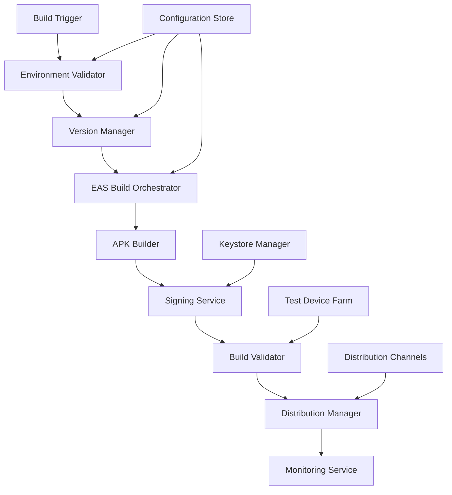

# Design Document: Mobile APK Build System

## Overview

This design document outlines the architecture for an automated APK build system for the Trinity React Native mobile application. The system leverages Expo Application Services (EAS) as the primary build platform while providing additional automation, validation, and distribution capabilities.

The current project uses Expo SDK 52 with React Native 0.76.9 and has existing EAS build configurations for development, preview, and production environments. The design extends this foundation with enhanced automation, validation, and monitoring capabilities.

## Architecture

The APK build system follows a pipeline architecture with the following main components:



### Core Components

1. **Build Orchestrator**: Coordinates the entire build pipeline and manages build profiles
2. **Environment Validator**: Ensures consistent build environments and validates dependencies
3. **Version Manager**: Handles semantic versioning and build number management
4. **EAS Build Service**: Interfaces with Expo Application Services for actual compilation
5. **Signing Service**: Manages keystore operations and APK signing
6. **Build Validator**: Performs automated testing and validation of generated APKs
7. **Distribution Manager**: Handles APK deployment to various channels
8. **Monitoring Service**: Tracks build metrics and provides logging

## Components and Interfaces

### Build Orchestrator

**Purpose**: Central coordinator for the build pipeline

**Interface**:
```typescript
interface BuildOrchestrator {
  triggerBuild(profile: BuildProfile, options: BuildOptions): Promise<BuildResult>
  getBuildStatus(buildId: string): Promise<BuildStatus>
  cancelBuild(buildId: string): Promise<void>
  listBuilds(filters: BuildFilters): Promise<BuildSummary[]>
}

interface BuildProfile {
  name: 'development' | 'preview' | 'production'
  platform: 'android' | 'ios' | 'all'
  distribution: 'internal' | 'store'
  environment: Record<string, string>
}

interface BuildOptions {
  autoIncrement?: boolean
  skipValidation?: boolean
  distributionChannels?: string[]
  releaseNotes?: string
}
```

### Environment Validator

**Purpose**: Ensures consistent build environments

**Interface**:
```typescript
interface EnvironmentValidator {
  validateEnvironment(): Promise<ValidationResult>
  checkDependencies(): Promise<DependencyStatus>
  validateConfiguration(): Promise<ConfigurationStatus>
}

interface ValidationResult {
  isValid: boolean
  errors: ValidationError[]
  warnings: ValidationWarning[]
  environment: EnvironmentInfo
}
```

### Version Manager

**Purpose**: Manages application versioning and build numbers

**Interface**:
```typescript
interface VersionManager {
  getCurrentVersion(): Promise<VersionInfo>
  incrementVersion(type: 'major' | 'minor' | 'patch'): Promise<VersionInfo>
  incrementBuildNumber(): Promise<number>
  tagRelease(version: string, commitHash: string): Promise<void>
}

interface VersionInfo {
  version: string // semantic version (e.g., "1.2.3")
  buildNumber: number
  commitHash: string
  timestamp: Date
}
```

### EAS Build Service

**Purpose**: Interfaces with Expo Application Services

**Interface**:
```typescript
interface EASBuildService {
  submitBuild(profile: BuildProfile): Promise<EASBuildResult>
  getBuildLogs(buildId: string): Promise<string>
  downloadArtifact(buildId: string): Promise<Buffer>
  cancelBuild(buildId: string): Promise<void>
}

interface EASBuildResult {
  buildId: string
  status: 'pending' | 'in-progress' | 'completed' | 'failed' | 'canceled'
  artifactUrl?: string
  logsUrl?: string
  metadata: BuildMetadata
}
```

### Signing Service

**Purpose**: Manages APK signing with appropriate keystores

**Interface**:
```typescript
interface SigningService {
  signAPK(apkPath: string, profile: BuildProfile): Promise<SigningResult>
  validateKeystore(keystorePath: string): Promise<boolean>
  getSigningInfo(apkPath: string): Promise<SigningInfo>
}

interface SigningResult {
  signedApkPath: string
  signature: string
  certificate: CertificateInfo
}
```

### Build Validator

**Purpose**: Validates APK integrity and functionality

**Interface**:
```typescript
interface BuildValidator {
  validateAPK(apkPath: string): Promise<ValidationResult>
  runSmokeTests(apkPath: string): Promise<TestResult>
  checkPermissions(apkPath: string): Promise<PermissionCheck>
  validateSize(apkPath: string): Promise<SizeValidation>
}

interface TestResult {
  passed: boolean
  testResults: TestCase[]
  duration: number
  screenshots?: string[]
}
```

### Distribution Manager

**Purpose**: Handles APK distribution to various channels

**Interface**:
```typescript
interface DistributionManager {
  distribute(apkPath: string, channels: DistributionChannel[]): Promise<DistributionResult>
  generateDownloadLink(apkPath: string): Promise<string>
  notifyStakeholders(buildInfo: BuildInfo): Promise<void>
}

interface DistributionChannel {
  type: 'internal' | 'beta' | 'store'
  config: ChannelConfig
}
```

## Data Models

### Build Configuration

```typescript
interface BuildConfiguration {
  project: ProjectConfig
  android: AndroidConfig
  signing: SigningConfig
  validation: ValidationConfig
  distribution: DistributionConfig
}

interface ProjectConfig {
  name: string
  slug: string
  version: string
  runtimeVersion: string
  sdkVersion: string
}

interface AndroidConfig {
  package: string
  compileSdkVersion: number
  targetSdkVersion: number
  minSdkVersion: number
  buildToolsVersion: string
  keystorePath: string
  keyAlias: string
}
```

### Build Metadata

```typescript
interface BuildMetadata {
  buildId: string
  profile: string
  platform: string
  version: VersionInfo
  environment: EnvironmentInfo
  timing: BuildTiming
  artifacts: BuildArtifact[]
}

interface BuildTiming {
  started: Date
  completed?: Date
  duration?: number
  phases: PhaseTimings
}

interface BuildArtifact {
  type: 'apk' | 'aab' | 'logs' | 'sourcemap'
  path: string
  size: number
  checksum: string
}
```

## Correctness Properties

*A property is a characteristic or behavior that should hold true across all valid executions of a system-essentially, a formal statement about what the system should do. Properties serve as the bridge between human-readable specifications and machine-verifiable correctness guarantees.*

Now I'll analyze the acceptance criteria to determine which ones can be tested as properties:

### Property Reflection

After analyzing all acceptance criteria, I identified several areas where properties can be consolidated:

- Properties 1.1-1.4 all relate to the compilation and packaging process and can be combined into comprehensive build process properties
- Properties 2.1-2.3 all relate to environment consistency and can be combined
- Properties 3.1-3.5 all relate to version management and can be streamlined
- Properties 4.1-4.5 all relate to signing and can be consolidated
- Properties 5.1-5.5 all relate to build optimization
- Properties 6.1-6.5 all relate to validation
- Properties 7.1-7.5 all relate to distribution
- Properties 8.1-8.5 all relate to monitoring and logging

### Converting EARS to Properties

Based on the prework analysis, here are the key correctness properties:

**Property 1: Build Process Integrity**
*For any* valid TypeScript source code and assets, the build process should successfully compile, package, and validate the resulting APK with all required components included.
**Validates: Requirements 1.1, 1.2, 1.3, 1.4**

**Property 2: Environment Consistency**
*For any* build execution, the system should use consistent Node.js, React Native, and Android SDK versions as specified in the configuration.
**Validates: Requirements 2.1, 2.2, 2.3**

**Property 3: Version Management Correctness**
*For any* build sequence, version numbers should increment monotonically and follow semantic versioning rules, with each APK containing accurate version metadata.
**Validates: Requirements 3.1, 3.2, 3.3, 3.5**

**Property 4: Signing Consistency**
*For any* build profile (debug/release), the APK should be signed with the appropriate keystore and have a valid, verifiable signature.
**Validates: Requirements 4.1, 4.2, 4.4**

**Property 5: Build Optimization Effectiveness**
*For any* release build, the APK should be optimized with minification, asset compression, and unused code removal compared to debug builds.
**Validates: Requirements 5.1, 5.2, 5.3, 5.4**

**Property 6: Validation Completeness**
*For any* generated APK, the validation process should verify installability, permissions, size limits, and functional correctness.
**Validates: Requirements 6.1, 6.2, 6.3, 6.4**

**Property 7: Distribution Reliability**
*For any* successful build, the APK should be distributed to all configured channels with appropriate metadata and notifications.
**Validates: Requirements 7.1, 7.2, 7.3, 7.5**

**Property 8: Monitoring and Logging Completeness**
*For any* build execution, the system should log all steps with timing information, capture errors with stack traces, and generate comprehensive metrics.
**Validates: Requirements 8.1, 8.2, 8.3, 8.4, 8.5**

**Property 9: Error Handling Consistency**
*For any* build failure (compilation, signing, validation), the system should provide detailed error messages and prevent progression to subsequent steps.
**Validates: Requirements 1.5, 2.5, 4.5, 6.5**

**Property 10: Git Integration Correctness**
*For any* release build, the system should create appropriate git tags and include accurate commit hash information in the APK metadata.
**Validates: Requirements 3.4**

## Error Handling

The system implements comprehensive error handling at each stage:

### Build Errors
- **Compilation Failures**: Capture TypeScript/JavaScript errors with source maps
- **Dependency Issues**: Report missing or incompatible package versions
- **Asset Problems**: Identify missing or corrupted assets

### Environment Errors
- **SDK Mismatches**: Detect and report Android SDK version conflicts
- **Tool Availability**: Verify required build tools are installed and accessible
- **Configuration Issues**: Validate all required environment variables and settings

### Signing Errors
- **Keystore Problems**: Detect corrupted or inaccessible keystores
- **Certificate Issues**: Report expired or invalid certificates
- **Permission Errors**: Handle insufficient permissions for keystore access

### Distribution Errors
- **Upload Failures**: Retry logic for network issues during distribution
- **Authentication Problems**: Clear error messages for credential issues
- **Channel Unavailability**: Graceful handling of unavailable distribution channels

### Recovery Strategies
- **Automatic Retries**: Configurable retry logic for transient failures
- **Fallback Options**: Alternative distribution channels when primary fails
- **Partial Success Handling**: Continue with available channels if some fail
- **State Preservation**: Maintain build state for manual intervention

## Testing Strategy

The APK build system requires comprehensive testing using both unit tests and property-based tests to ensure reliability across all build scenarios.

### Unit Testing Approach

Unit tests focus on specific components and integration points:

**Component Testing**:
- Environment Validator: Test specific SDK version checks and dependency validation
- Version Manager: Test version increment logic and semantic versioning rules
- Signing Service: Test keystore operations and signature verification
- Build Validator: Test APK analysis and smoke test execution

**Integration Testing**:
- EAS Build Service integration with mock responses
- Distribution channel connectivity and authentication
- End-to-end build pipeline with test projects
- Error propagation between components

**Edge Case Testing**:
- Large APK files and memory constraints
- Network interruptions during distribution
- Corrupted keystores and invalid certificates
- Missing dependencies and configuration errors

### Property-Based Testing Configuration

Property-based tests verify universal properties across all inputs using **fast-check** library with minimum 100 iterations per test:

**Build Process Properties**:
- **Feature: mobile-apk-build, Property 1**: Build process integrity across different source code variations
- **Feature: mobile-apk-build, Property 2**: Environment consistency across multiple build executions
- **Feature: mobile-apk-build, Property 3**: Version management correctness with various increment patterns

**Validation Properties**:
- **Feature: mobile-apk-build, Property 6**: Validation completeness across different APK configurations
- **Feature: mobile-apk-build, Property 9**: Error handling consistency across various failure scenarios

**Distribution Properties**:
- **Feature: mobile-apk-build, Property 7**: Distribution reliability across different channel configurations
- **Feature: mobile-apk-build, Property 8**: Monitoring completeness across various build scenarios

### Test Data Generation

Property-based tests use intelligent generators:

**Source Code Generators**:
- Valid TypeScript code with varying complexity
- Asset collections with different file types and sizes
- Configuration variations within valid ranges

**Build Configuration Generators**:
- Different build profiles (development, preview, production)
- Various environment variable combinations
- Different Android SDK and tool versions

**Error Scenario Generators**:
- Invalid source code with different error types
- Missing dependencies and configuration issues
- Network failures and timeout scenarios

### Continuous Integration

The testing strategy integrates with CI/CD pipelines:

**Pre-commit Testing**:
- Unit tests for modified components
- Property tests for core build logic
- Configuration validation tests

**Build Pipeline Testing**:
- Full property-based test suite execution
- Integration tests with real EAS builds
- Performance regression testing

**Release Testing**:
- End-to-end build validation
- Distribution channel verification
- Rollback procedure testing

The dual testing approach ensures both specific functionality (unit tests) and universal correctness (property tests) while maintaining fast feedback cycles and comprehensive coverage.