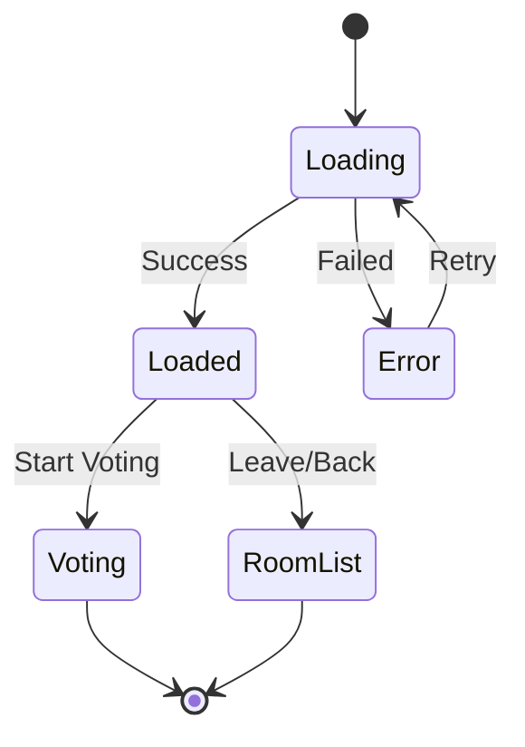

# Design Document: Room Details Screen

## Overview

The Room Details Screen serves as an intermediate interface between room selection and voting activities. It provides comprehensive information about a room, facilitates member management, and allows hosts to control when voting begins. This screen enhances user experience by making room sharing easier and providing transparency about room status and participants.

## Architecture

### Component Structure

```
RoomDetailsScreen
├── RoomHeader
│   ├── RoomTitle
│   ├── RoomDescription
│   └── RoomStatus
├── InviteSection
│   ├── InviteCode
│   ├── CopyButton
│   └── ShareableLink
├── MembersPanel
│   ├── MembersList
│   ├── MemberCount
│   └── HostIndicator
├── RoomConfiguration
│   ├── GenresList
│   ├── MovieCount
│   └── VotingSettings
├── ActionButtons
│   ├── StartVotingButton (host only)
│   ├── WaitingMessage (members)
│   └── LeaveRoomButton
└── NavigationBar
    └── BackButton
```

### State Management

The component will manage the following state:

```typescript
interface RoomDetailsState {
  room: Room | null;
  members: Member[];
  isHost: boolean;
  isLoading: boolean;
  error: string | null;
  connectionStatus: 'connected' | 'connecting' | 'disconnected';
  copySuccess: boolean;
}
```

## Components and Interfaces

### Core Interfaces

```typescript
interface Room {
  id: string;
  name: string;
  description?: string;
  status: 'waiting' | 'active' | 'completed';
  hostId: string;
  inviteCode: string;
  genres: string[];
  movieCount: number;
  createdAt: string;
  memberCount: number;
}

interface Member {
  id: string;
  email: string;
  displayName?: string;
  isHost: boolean;
  isConnected: boolean;
  joinedAt: string;
}

interface RoomDetailsProps {
  roomId: string;
  onStartVoting: () => void;
  onLeaveRoom: () => void;
  onBack: () => void;
}
```

### Component APIs

#### RoomDetailsScreen Component

**Props:**
- `roomId: string` - ID of the room to display
- `onStartVoting: () => void` - Callback when host starts voting
- `onLeaveRoom: () => void` - Callback when user leaves room
- `onBack: () => void` - Callback for navigation back

**Methods:**
- `loadRoomDetails()` - Fetch room information
- `subscribeToUpdates()` - Setup real-time subscriptions
- `copyInviteCode()` - Copy invite code to clipboard
- `startVoting()` - Initiate voting session (host only)
- `leaveRoom()` - Leave the current room

#### InviteSection Component

**Props:**
- `inviteCode: string` - The room's invite code
- `onCopy: (code: string) => void` - Callback when code is copied

**Features:**
- Large, readable invite code display
- One-click copy to clipboard
- Visual feedback on successful copy
- Shareable link generation

#### MembersPanel Component

**Props:**
- `members: Member[]` - List of room members
- `currentUserId: string` - ID of current user

**Features:**
- Real-time member list updates
- Host identification
- Connection status indicators
- Member count display

## Data Models

### Room Data Structure

```typescript
interface RoomDetails {
  // Basic Information
  id: string;
  name: string;
  description?: string;
  status: RoomStatus;
  
  // Access Control
  hostId: string;
  inviteCode: string;
  
  // Configuration
  genres: string[];
  movieCount: number;
  votingType: 'like_dislike' | 'rating';
  
  // Metadata
  createdAt: string;
  updatedAt: string;
  memberCount: number;
}

enum RoomStatus {
  WAITING = 'waiting',
  ACTIVE = 'active', 
  COMPLETED = 'completed'
}
```

### Member Data Structure

```typescript
interface RoomMember {
  id: string;
  userId: string;
  email: string;
  displayName?: string;
  isHost: boolean;
  isConnected: boolean;
  joinedAt: string;
  lastSeen: string;
}
```

## Real-time Integration

### WebSocket Subscriptions

The screen will subscribe to the following real-time events:

1. **Member Updates**
   ```graphql
   subscription OnMemberUpdate($roomId: ID!) {
     onMemberUpdate(roomId: $roomId) {
       id
       userId
       email
       isConnected
       joinedAt
     }
   }
   ```

2. **Room Status Changes**
   ```graphql
   subscription OnRoomStatusChange($roomId: ID!) {
     onRoomStatusChange(roomId: $roomId) {
       id
       status
       updatedAt
     }
   }
   ```

3. **Voting Session Start**
   ```graphql
   subscription OnVotingStart($roomId: ID!) {
     onVotingStart(roomId: $roomId) {
       roomId
       startedBy
       startedAt
     }
   }
   ```

### GraphQL Queries and Mutations

#### Queries

```graphql
query GetRoomDetails($roomId: ID!) {
  getRoomDetails(roomId: $roomId) {
    id
    name
    description
    status
    hostId
    inviteCode
    genres
    movieCount
    createdAt
    memberCount
    members {
      id
      userId
      email
      displayName
      isHost
      isConnected
      joinedAt
    }
  }
}
```

#### Mutations

```graphql
mutation StartVotingSession($roomId: ID!) {
  startVotingSession(roomId: $roomId) {
    success
    message
    sessionId
  }
}

mutation LeaveRoom($roomId: ID!) {
  leaveRoom(roomId: $roomId) {
    success
    message
  }
}
```

## User Interface Design

### Layout Structure

```
┌─────────────────────────────────────┐
│ ← Back          Room Details        │
├─────────────────────────────────────┤
│                                     │
│  🎬 [Room Name]                     │
│  [Room Description]                 │
│  Status: ● Waiting for members      │
│                                     │
├─────────────────────────────────────┤
│  📋 Invite Code                     │
│  ┌─────────────┐ ┌──────────────┐   │
│  │   ABC123    │ │   📋 Copy   │   │
│  └─────────────┘ └──────────────┘   │
│  Share: localhost:3000/room/ABC123  │
├─────────────────────────────────────┤
│  👥 Members (2)                     │
│  • test@trinity.app (Host) ●        │
│  • test@trinity.com ●               │
├─────────────────────────────────────┤
│  🎭 Configuration                   │
│  Genres: Action, Comedy, Drama      │
│  Movies: ~50 películas              │
│  Voting: Like/Dislike system       │
├─────────────────────────────────────┤
│  ┌─────────────────────────────────┐ │
│  │      🚀 Empezar Votación       │ │
│  └─────────────────────────────────┘ │
│  ┌─────────────────────────────────┐ │
│  │         Salir de la Sala        │ │
│  └─────────────────────────────────┘ │
└─────────────────────────────────────┘
```

### Responsive Design

**Mobile Layout:**
- Stack sections vertically
- Larger touch targets for buttons
- Collapsible sections for better space usage
- Swipe gestures for navigation

**Web Layout:**
- Two-column layout on larger screens
- Hover effects for interactive elements
- Keyboard shortcuts support
- Context menus for additional actions

### Visual Design Elements

**Color Scheme:**
- Primary: `#8b5cf6` (Purple)
- Success: `#22c55e` (Green)
- Warning: `#eab308` (Yellow)
- Error: `#ef4444` (Red)
- Background: `#1a1a2e` (Dark Blue)

**Typography:**
- Headers: Bold, 18-24px
- Body text: Regular, 14-16px
- Code/Invite: Monospace, 16px
- Captions: Light, 12px

**Interactive Elements:**
- Buttons: Rounded corners, hover/press states
- Copy feedback: Toast notifications
- Loading states: Skeleton screens
- Error states: Inline error messages

## Navigation Flow

### Entry Points

1. **After Room Creation:**
   ```
   Create Room Modal → Room Details Screen
   ```

2. **From Room Selection:**
   ```
   Room List → Room Details Screen
   ```

3. **From Invite Link:**
   ```
   Invite URL → Join Room → Room Details Screen
   ```

### Exit Points

1. **Start Voting (Host):**
   ```
   Room Details → Voting Interface
   ```

2. **Leave Room:**
   ```
   Room Details → Room List
   ```

3. **Back Navigation:**
   ```
   Room Details → Room List
   ```

### State Transitions



## Error Handling

### Error Scenarios

1. **Room Not Found**
   - Display: "Sala no encontrada"
   - Action: Return to room list
   - Logging: Log room ID and user context

2. **Permission Denied**
   - Display: "No tienes acceso a esta sala"
   - Action: Return to room list
   - Logging: Log access attempt

3. **Network Connection Lost**
   - Display: Connection status indicator
   - Action: Attempt automatic reconnection
   - Fallback: Manual refresh button

4. **Failed to Start Voting**
   - Display: "Error al iniciar votación"
   - Action: Retry button
   - Logging: Log error details

### Error Recovery

```typescript
interface ErrorRecovery {
  retryAttempts: number;
  backoffStrategy: 'exponential' | 'linear';
  fallbackActions: string[];
  userNotification: boolean;
}
```

## Performance Considerations

### Optimization Strategies

1. **Data Fetching**
   - Cache room details locally
   - Implement optimistic updates
   - Batch member updates

2. **Real-time Updates**
   - Debounce rapid member changes
   - Limit update frequency
   - Use efficient diff algorithms

3. **Rendering**
   - Virtualize large member lists
   - Lazy load non-critical data
   - Implement proper memoization

### Metrics to Monitor

- Screen load time
- Real-time update latency
- Memory usage during long sessions
- Battery impact on mobile devices

## Testing Strategy

### Unit Tests

1. **Component Rendering**
   - Verify all sections display correctly
   - Test different room states
   - Validate responsive behavior

2. **State Management**
   - Test state updates
   - Verify error handling
   - Check loading states

3. **User Interactions**
   - Copy to clipboard functionality
   - Button click handlers
   - Navigation actions

### Integration Tests

1. **Real-time Updates**
   - Member join/leave events
   - Room status changes
   - Connection handling

2. **API Integration**
   - Room data fetching
   - Mutation execution
   - Error responses

### End-to-End Tests

1. **Complete User Flows**
   - Room creation to voting start
   - Invite sharing and joining
   - Multi-user scenarios

2. **Cross-Platform Testing**
   - Web browser compatibility
   - Mobile device testing
   - Network condition variations

## Correctness Properties

*A property is a characteristic or behavior that should hold true across all valid executions of a system-essentially, a formal statement about what the system should do. Properties serve as the bridge between human-readable specifications and machine-verifiable correctness guarantees.*

### Property 1: Room Information Display Completeness
*For any* valid room, the Room Details Screen should display the room name, status, and invite code prominently
**Validates: Requirements 1.3, 1.5, 2.1**

### Property 2: Conditional Description Display
*For any* room with a description field, the Room Details Screen should display that description
**Validates: Requirements 1.4**

### Property 3: Copy-to-Clipboard Functionality
*For any* room with an invite code, clicking the copy button should copy the exact invite code to the clipboard and show confirmation
**Validates: Requirements 2.3**

### Property 4: Shareable Link Generation
*For any* room, the Room Details Screen should generate a properly formatted shareable link containing the invite code
**Validates: Requirements 2.4**

### Property 5: Member List Accuracy
*For any* room, the displayed member list should contain exactly the same members as the actual room membership, with correct host identification
**Validates: Requirements 3.1, 3.3, 3.4**

### Property 6: Member Count Consistency
*For any* room, the displayed member count should equal the actual number of members in the member list
**Validates: Requirements 3.5**

### Property 7: Real-time Member Updates
*For any* member join or leave event, the member list should update to reflect the change within a reasonable time window
**Validates: Requirements 3.2, 6.2**

### Property 8: Room Configuration Display
*For any* room, the Room Details Screen should display the configured genres, movie count, and voting format
**Validates: Requirements 4.1, 4.2, 4.5**

### Property 9: Host-Specific UI Elements
*For any* user who is the room host, the Room Details Screen should display the "Empezar Votación" button and not the waiting message
**Validates: Requirements 5.1**

### Property 10: Non-Host UI Elements
*For any* user who is not the room host, the Room Details Screen should display the "Esperando al host..." message and not the start voting button
**Validates: Requirements 5.3**

### Property 11: Universal Leave Option
*For any* user in any room, the Room Details Screen should provide a "Salir de la Sala" option
**Validates: Requirements 5.4**

### Property 12: Real-time Status Updates
*For any* room status change, the Room Details Screen should automatically update to reflect the new status
**Validates: Requirements 6.1**

### Property 13: Synchronized Voting Transition
*For any* room where the host starts voting, all connected members should automatically transition to voting mode
**Validates: Requirements 6.3**

### Property 14: Connection Management
*For any* Room Details Screen instance, a WebSocket connection should be maintained for real-time updates
**Validates: Requirements 6.4**

### Property 15: Connection Recovery
*For any* connection loss event, the system should show connection status and attempt to reconnect
**Validates: Requirements 6.5**

### Property 16: Navigation Elements
*For any* Room Details Screen instance, a back button should be present and functional
**Validates: Requirements 7.1**

### Property 17: Loading State Display
*For any* room data fetch operation, appropriate loading states should be displayed during the fetch process
**Validates: Requirements 7.4**

### Property 18: Error Handling with Recovery
*For any* failed room data load, the system should display an error message with retry options
**Validates: Requirements 7.5**

## Security Considerations

### Access Control

- Verify user permissions for room access
- Validate host privileges for room control
- Sanitize all user inputs

### Data Protection

- Encrypt sensitive room data
- Implement rate limiting for API calls
- Audit room access attempts

### Privacy

- Limit member information exposure
- Respect user privacy settings
- Implement data retention policies