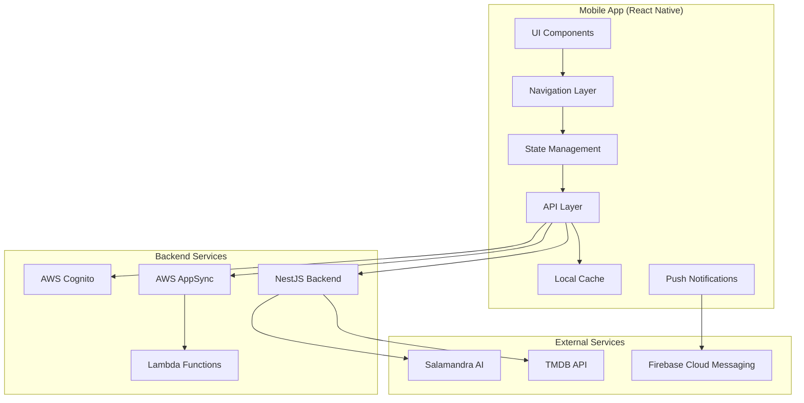
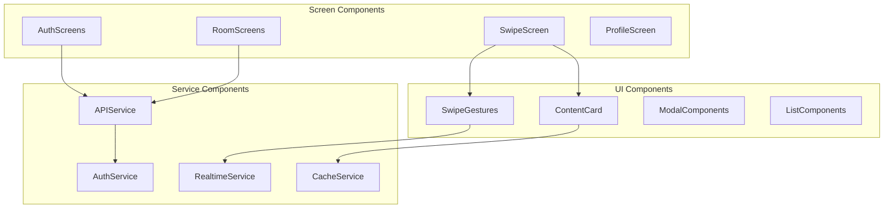

# Trinity Mobile App - Design Document

## Overview

La aplicación móvil Trinity es una aplicación React Native que proporciona una experiencia nativa optimizada para la plataforma Trinity MVP. La aplicación permite a los usuarios participar en Salas de Consenso mediante gestos de swipe intuitivos, recibir recomendaciones de IA personalizadas, y mantenerse sincronizados en tiempo real con otros miembros de la sala.

La arquitectura sigue patrones modernos de React Native con gestión de estado centralizada, navegación nativa, y integración robusta con el backend NestJS existente.

## Architecture

### High-Level Architecture



### Technology Stack

- **Framework**: React Native 0.73+
- **Navigation**: React Navigation 6.x
- **State Management**: Zustand (lightweight, performant)
- **Networking**: Axios + React Query for caching
- **Real-time**: AWS AppSync GraphQL Subscriptions
- **Gestures**: React Native Gesture Handler + Reanimated 3
- **Authentication**: AWS Amplify Auth
- **Push Notifications**: React Native Firebase
- **Local Storage**: AsyncStorage + MMKV for performance
- **UI Components**: React Native Elements + Custom components
- **Testing**: Jest + React Native Testing Library

## Components and Interfaces

### Core Components Architecture



### Component Specifications

#### 1. Authentication Components

**AuthNavigator**
- Handles authentication flow navigation
- Integrates with AWS Cognito via Amplify
- Manages secure token storage
- Provides biometric authentication options

**LoginScreen**
```typescript
interface LoginScreenProps {
  onLoginSuccess: (user: AuthUser) => void;
  onNavigateToRegister: () => void;
}

interface LoginFormData {
  email: string;
  password: string;
  rememberMe: boolean;
}
```

**RegisterScreen**
```typescript
interface RegisterScreenProps {
  onRegisterSuccess: (user: AuthUser) => void;
  onNavigateToLogin: () => void;
}

interface RegisterFormData {
  email: string;
  password: string;
  confirmPassword: string;
  displayName: string;
}
```

#### 2. Room Management Components

**RoomListScreen**
- Displays available rooms with search/filter
- Shows room metadata (members, status, content type)
- Handles room joining/creation
- Implements pull-to-refresh and infinite scroll

**RoomDetailScreen**
```typescript
interface RoomDetailScreenProps {
  roomId: string;
  onJoinRoom: (roomId: string) => void;
  onStartSwipe: (roomId: string) => void;
}

interface RoomDetailData {
  id: string;
  name: string;
  description: string;
  members: RoomMember[];
  status: RoomStatus;
  contentType: ContentType;
  settings: RoomSettings;
}
```

#### 3. Swipe Interface Components

**SwipeScreen**
- Main content voting interface
- Implements native swipe gestures
- Shows content cards with rich media
- Handles vote submission and queue management

**ContentCard**
```typescript
interface ContentCardProps {
  content: MediaContent;
  onSwipeLeft: (contentId: string) => void;
  onSwipeRight: (contentId: string) => void;
  onCardTap: (contentId: string) => void;
}

interface MediaContent {
  id: string;
  title: string;
  overview: string;
  posterPath: string;
  backdropPath: string;
  releaseDate: string;
  genres: Genre[];
  rating: number;
  runtime?: number;
}
```

**SwipeGestureHandler**
```typescript
interface SwipeGestureConfig {
  threshold: number;
  velocityThreshold: number;
  animationDuration: number;
  snapBackThreshold: number;
}

interface SwipeGestureCallbacks {
  onSwipeStart: () => void;
  onSwipeProgress: (progress: number, direction: SwipeDirection) => void;
  onSwipeComplete: (direction: SwipeDirection) => void;
  onSwipeCancel: () => void;
}
```

#### 4. Real-time Components

**RealtimeProvider**
- Manages WebSocket connections to AWS AppSync
- Handles subscription lifecycle
- Provides real-time data to components
- Implements reconnection logic

```typescript
interface RealtimeContextValue {
  isConnected: boolean;
  subscribeToRoom: (roomId: string) => void;
  unsubscribeFromRoom: (roomId: string) => void;
  sendVote: (vote: VoteData) => void;
  roomUpdates: RoomUpdate[];
  voteUpdates: VoteUpdate[];
  matchNotifications: MatchNotification[];
}
```

## Data Models

### Core Data Models

#### User Model
```typescript
interface User {
  id: string;
  email: string;
  displayName: string;
  avatar?: string;
  preferences: UserPreferences;
  createdAt: Date;
  lastActiveAt: Date;
}

interface UserPreferences {
  genres: string[];
  languages: string[];
  contentTypes: ContentType[];
  notificationSettings: NotificationSettings;
}
```

#### Room Model
```typescript
interface Room {
  id: string;
  name: string;
  description: string;
  creatorId: string;
  members: RoomMember[];
  status: RoomStatus;
  settings: RoomSettings;
  currentContent?: MediaContent;
  createdAt: Date;
  updatedAt: Date;
}

interface RoomMember {
  userId: string;
  displayName: string;
  role: MemberRole;
  joinedAt: Date;
  lastActiveAt: Date;
  isActive: boolean;
}

enum RoomStatus {
  WAITING = 'waiting',
  ACTIVE = 'active',
  PAUSED = 'paused',
  COMPLETED = 'completed'
}

enum MemberRole {
  ADMIN = 'admin',
  MODERATOR = 'moderator',
  MEMBER = 'member'
}
```

#### Vote Model
```typescript
interface Vote {
  id: string;
  userId: string;
  roomId: string;
  contentId: string;
  vote: VoteType;
  timestamp: Date;
  sessionId: string;
}

enum VoteType {
  POSITIVE = 'positive',
  NEGATIVE = 'negative',
  SKIP = 'skip'
}

interface VoteUpdate {
  roomId: string;
  contentId: string;
  userId: string;
  vote: VoteType;
  totalVotes: number;
  positiveVotes: number;
  timestamp: Date;
}
```

#### Match Model
```typescript
interface Match {
  id: string;
  roomId: string;
  contentId: string;
  content: MediaContent;
  participants: string[];
  createdAt: Date;
  watchedAt?: Date;
}

interface MatchNotification {
  matchId: string;
  roomId: string;
  content: MediaContent;
  participants: RoomMember[];
  timestamp: Date;
}
```

### State Management Models

#### Global State Structure
```typescript
interface AppState {
  auth: AuthState;
  rooms: RoomsState;
  swipe: SwipeState;
  realtime: RealtimeState;
  cache: CacheState;
  ui: UIState;
}

interface AuthState {
  user: User | null;
  isAuthenticated: boolean;
  isLoading: boolean;
  error: string | null;
}

interface RoomsState {
  availableRooms: Room[];
  currentRoom: Room | null;
  myRooms: Room[];
  isLoading: boolean;
  error: string | null;
}

interface SwipeState {
  currentContent: MediaContent | null;
  contentQueue: MediaContent[];
  votes: Vote[];
  isVoting: boolean;
  queuePosition: number;
  totalContent: number;
}
```

## Correctness Properties

*A property is a characteristic or behavior that should hold true across all valid executions of a system-essentially, a formal statement about what the system should do. Properties serve as the bridge between human-readable specifications and machine-verifiable correctness guarantees.*

### Authentication Properties

**Property 1: Authentication Round Trip**
*For any* valid user credentials, authenticating and then checking authentication status should confirm the user is authenticated
**Validates: Requirements 1.2, 1.3**

**Property 2: Session Persistence**
*For any* authenticated user session, restarting the app should maintain the authentication state
**Validates: Requirements 1.5**

**Property 3: Authentication Error Handling**
*For any* invalid credentials, authentication attempts should result in clear error messages and retry options
**Validates: Requirements 1.4**

**Property 4: Logout Completeness**
*For any* authenticated user, logging out should clear all stored credentials and return to login screen
**Validates: Requirements 1.6**

### Room Management Properties

**Property 5: Room Search Filtering**
*For any* search query on available rooms, the results should only include rooms that match the search criteria
**Validates: Requirements 2.2**

**Property 6: Room Membership Updates**
*For any* valid room join request, the room membership should be updated to include the user
**Validates: Requirements 2.3**

**Property 7: Room Creation Consistency**
*For any* valid room configuration, creating a room should result in a room that matches the provided configuration
**Validates: Requirements 2.4**

**Property 8: Room Information Display**
*For any* room member, accessing room details should display current room status and member information
**Validates: Requirements 2.5**

**Property 9: Room Leave Updates**
*For any* room member leaving a room, the membership should be updated and the user should return to room discovery
**Validates: Requirements 2.6**

### Swipe Interface Properties

**Property 10: Swipe Vote Registration**
*For any* content card, swiping right should register a positive vote and swiping left should register a negative vote
**Validates: Requirements 3.2, 3.3**

**Property 11: Vote Transmission**
*For any* registered vote, the vote should be transmitted to the backend immediately
**Validates: Requirements 3.5**

**Property 12: Content Queue Management**
*For any* empty content queue, the system should automatically request more content from the shuffle system
**Validates: Requirements 3.6**

### Real-time Synchronization Properties

**Property 13: Real-time Vote Updates**
*For any* vote from another user in the same room, the UI should update with vote indicators in real-time
**Validates: Requirements 4.1**

**Property 14: Match Notification Immediacy**
*For any* match found in a room, match notifications should be displayed immediately
**Validates: Requirements 4.2**

**Property 15: Room Status Synchronization**
*For any* room status change, the room interface should update accordingly in real-time
**Validates: Requirements 4.3**

**Property 16: Member List Synchronization**
*For any* user joining or leaving a room, the member list should update in real-time
**Validates: Requirements 4.4**

**Property 17: Connection Recovery**
*For any* connection loss and restoration, the system should display connection status and synchronize missed updates
**Validates: Requirements 4.5, 4.6**

### AI Recommendations Properties

**Property 18: AI Processing Consistency**
*For any* mood text submitted to AI recommendations, the request should be processed via Salamandra integration
**Validates: Requirements 5.2**

**Property 19: AI Response Display**
*For any* AI recommendation response, the system should display suggested content with reasoning
**Validates: Requirements 5.3**

**Property 20: AI Recommendation Injection**
*For any* accepted AI recommendation, the content should be injected into the user's room queue
**Validates: Requirements 5.4**

**Property 21: AI Fallback Mechanism**
*For any* AI service unavailability, the system should provide fallback recommendations from user history
**Validates: Requirements 5.5**

**Property 22: AI Metadata Display**
*For any* displayed AI recommendation, confidence levels and emotional state analysis should be shown
**Validates: Requirements 5.6**

### Push Notifications Properties

**Property 23: Match Notification Delivery**
*For any* match found in a user's room, a push notification should be sent
**Validates: Requirements 6.1**

**Property 24: Invitation Notification Delivery**
*For any* room invitation, a push notification should be sent to the invited user
**Validates: Requirements 6.2**

**Property 25: Session Reminder Notifications**
*For any* upcoming room session, a reminder notification should be sent
**Validates: Requirements 6.3**

**Property 26: Notification Navigation**
*For any* notification tap, the app should navigate directly to the relevant screen
**Validates: Requirements 6.4**

**Property 27: Notification Preferences**
*For any* user who disables notifications, the system should respect the preference and stop sending notifications
**Validates: Requirements 6.5**

**Property 28: Notification Tracking**
*For any* sent notification, delivery and engagement metrics should be tracked
**Validates: Requirements 6.6**

### Offline Capabilities Properties

**Property 29: Offline Content Access**
*For any* previously loaded content, the content should remain accessible when the app goes offline
**Validates: Requirements 7.1**

**Property 30: Offline Vote Queuing**
*For any* vote made while offline, the vote should be queued for synchronization when connectivity is restored
**Validates: Requirements 7.2**

**Property 31: Offline Synchronization**
*For any* queued actions when connectivity is restored, all actions should be synchronized with the backend
**Validates: Requirements 7.3**

**Property 32: Offline Data Display**
*For any* cached room data, the information should be displayable when offline
**Validates: Requirements 7.4**

**Property 33: Offline Feature Messaging**
*For any* feature requiring connectivity when offline, appropriate offline messages should be displayed
**Validates: Requirements 7.5**

**Property 34: Cache Management**
*For any* cached data, storage limits should be respected and cache eviction policies should be implemented
**Validates: Requirements 7.6**

### Content Display Properties

**Property 35: Content Card Completeness**
*For any* displayed content card, movie/show posters, titles, and key metadata should be shown
**Validates: Requirements 8.1**

**Property 36: Image Loading Optimization**
*For any* image loading, progressive loading and caching should be implemented
**Validates: Requirements 8.2**

**Property 37: Content Detail Modal**
*For any* content tap, an expanded information modal should be displayed
**Validates: Requirements 8.3**

**Property 38: Trailer Playback Options**
*For any* content with video trailers, trailer playback options should be provided
**Validates: Requirements 8.4**

**Property 39: Image Error Handling**
*For any* failed image load, placeholder images with retry options should be displayed
**Validates: Requirements 8.5**

**Property 40: Mobile Image Optimization**
*For any* displayed content, images should be optimized for mobile screens
**Validates: Requirements 8.6**

### Performance Properties

**Property 41: App Launch Performance**
*For any* app launch, the main interface should be displayed within 3 seconds
**Validates: Requirements 9.1**

**Property 42: Navigation Performance**
*For any* screen transition, smooth transitions should be provided under 500ms
**Validates: Requirements 9.2**

**Property 43: Loading Indicators**
*For any* content loading operation, loading indicators and skeleton screens should be displayed
**Validates: Requirements 9.3**

**Property 44: App State Preservation**
*For any* app backgrounding, state should be maintained and the app should resume quickly
**Validates: Requirements 9.5**

**Property 45: Memory Management**
*For any* memory usage exceeding limits, efficient memory management should be implemented
**Validates: Requirements 9.6**

### Accessibility Properties

**Property 46: Screen Reader Support**
*For any* UI element when using screen readers, appropriate accessibility labels and hints should be provided
**Validates: Requirements 10.1**

**Property 47: Voice Control Support**
*For any* key action, voice navigation should be supported when using voice control
**Validates: Requirements 10.2**

**Property 48: Text Scaling Support**
*For any* text size increase, text should scale appropriately while maintaining layout
**Validates: Requirements 10.3**

**Property 49: High Contrast Support**
*For any* high contrast mode activation, colors should be adjusted for better visibility
**Validates: Requirements 10.4**

**Property 50: Localization Support**
*For any* Spanish language setting, Spanish text and labels should be displayed
**Validates: Requirements 10.5**

**Property 51: Accessibility Feature Compatibility**
*For any* enabled accessibility feature, full functionality should be maintained
**Validates: Requirements 10.6**

<function_calls>
<invoke name="prework">
<parameter name="featureName">trinity-mobile-app

## Error Handling

### Error Handling Strategy

La aplicación implementa una estrategia de manejo de errores en múltiples capas para proporcionar una experiencia de usuario robusta:

#### 1. Network Error Handling

**Connection Errors**
- Detección automática de pérdida de conectividad
- Modo offline automático con funcionalidad limitada
- Reintentos automáticos con backoff exponencial
- Notificaciones de estado de conexión al usuario

**API Error Handling**
```typescript
interface APIError {
  code: string;
  message: string;
  details?: any;
  retryable: boolean;
}

interface ErrorHandlingConfig {
  maxRetries: number;
  retryDelay: number;
  backoffMultiplier: number;
  timeoutMs: number;
}
```

#### 2. Authentication Error Handling

**Token Expiration**
- Detección automática de tokens expirados
- Refresh automático de tokens cuando es posible
- Logout automático cuando el refresh falla
- Redirección a pantalla de login con mensaje explicativo

**Cognito Integration Errors**
- Manejo específico de errores de AWS Cognito
- Mensajes de error localizados y comprensibles
- Opciones de recuperación (reset password, reenvío de confirmación)

#### 3. Real-time Connection Error Handling

**WebSocket Connection Errors**
- Reconexión automática con backoff exponencial
- Detección de conexiones zombie
- Fallback a polling cuando WebSocket falla
- Sincronización de estado al reconectar

#### 4. UI Error Boundaries

**React Error Boundaries**
```typescript
interface ErrorBoundaryState {
  hasError: boolean;
  error: Error | null;
  errorInfo: ErrorInfo | null;
}

class AppErrorBoundary extends Component<Props, ErrorBoundaryState> {
  // Captura errores de componentes hijos
  // Proporciona UI de fallback
  // Reporta errores para análisis
}
```

#### 5. Offline Error Handling

**Offline Operations**
- Queue de acciones para sincronizar cuando vuelva la conexión
- Validación de acciones offline vs online
- Resolución de conflictos de sincronización
- Notificaciones de estado offline/online

### Error Recovery Mechanisms

#### Automatic Recovery
- Reintentos automáticos para errores transitorios
- Reconexión automática para errores de red
- Refresh automático de tokens de autenticación
- Sincronización automática al restaurar conectividad

#### User-Initiated Recovery
- Botones de "Reintentar" en pantallas de error
- Pull-to-refresh en listas y contenido
- Opciones de "Reportar problema" para errores persistentes
- Acceso a logs de debug en modo desarrollador

## Testing Strategy

### Dual Testing Approach

La estrategia de testing combina unit tests y property-based tests para asegurar cobertura completa:

**Unit Tests**
- Componentes individuales de React Native
- Funciones de utilidad y helpers
- Servicios de API y manejo de estado
- Casos específicos y edge cases
- Integración con mocks para servicios externos

**Property-Based Tests**
- Validación de propiedades universales del sistema
- Testing con datos generados aleatoriamente
- Verificación de invariantes del sistema
- Mínimo 100 iteraciones por test de propiedad

### Testing Framework Configuration

**Jest Configuration**
```javascript
module.exports = {
  preset: 'react-native',
  setupFilesAfterEnv: ['<rootDir>/src/test/setup.ts'],
  testMatch: ['**/__tests__/**/*.test.{js,ts,tsx}'],
  collectCoverageFrom: [
    'src/**/*.{js,ts,tsx}',
    '!src/**/*.d.ts',
    '!src/test/**/*'
  ],
  coverageThreshold: {
    global: {
      branches: 80,
      functions: 80,
      lines: 80,
      statements: 80
    }
  }
};
```

**Property-Based Testing with fast-check**
```typescript
import fc from 'fast-check';

// Ejemplo de property test para autenticación
describe('Authentication Properties', () => {
  it('Property 1: Authentication Round Trip', () => {
    fc.assert(fc.property(
      fc.record({
        email: fc.emailAddress(),
        password: fc.string({ minLength: 8 })
      }),
      async (credentials) => {
        // Feature: trinity-mobile-app, Property 1: Authentication Round Trip
        const authResult = await authService.authenticate(credentials);
        expect(authResult.success).toBe(true);
        
        const isAuthenticated = await authService.isAuthenticated();
        expect(isAuthenticated).toBe(true);
      }
    ), { numRuns: 100 });
  });
});
```

### Test Categories

#### 1. Component Tests
- Renderizado correcto de componentes
- Interacciones de usuario (taps, swipes, inputs)
- Props y state management
- Navegación entre pantallas

#### 2. Integration Tests
- Flujos completos de usuario (login → room → swipe → match)
- Integración con APIs del backend
- Real-time synchronization
- Offline/online transitions

#### 3. Performance Tests
- Tiempo de carga de pantallas
- Rendimiento de animaciones
- Uso de memoria
- Tiempo de respuesta de gestos

#### 4. Accessibility Tests
- Screen reader compatibility
- Voice control functionality
- High contrast mode
- Text scaling support

#### 5. Platform-Specific Tests
- iOS vs Android behavior differences
- Device-specific features (biometrics, notifications)
- Different screen sizes and orientations
- OS version compatibility

### Property Test Configuration

Cada property test debe:
- Ejecutarse con mínimo 100 iteraciones
- Incluir comentario con referencia a la propiedad del diseño
- Usar generadores apropiados para el dominio de datos
- Validar invariantes del sistema

**Formato de etiquetas:**
```typescript
// Feature: trinity-mobile-app, Property {number}: {property_text}
```

### Continuous Integration

**Test Pipeline**
1. Unit tests execution
2. Property-based tests execution
3. Integration tests with backend mocks
4. Performance benchmarking
5. Accessibility validation
6. Platform-specific testing (iOS/Android)

**Quality Gates**
- 90% test coverage minimum
- All property tests passing with 100+ iterations
- Performance benchmarks within acceptable limits
- Zero accessibility violations
- Successful builds for both iOS and Android

### Mock Strategy

**Backend API Mocking**
- Mock Service Worker (MSW) para APIs REST
- GraphQL mocks para subscriptions de AppSync
- Simulación de estados de red (offline, slow, error)

**External Service Mocking**
- AWS Cognito authentication flows
- Push notification services
- Image loading and caching
- Device-specific APIs (camera, storage)

Esta estrategia de testing asegura que la aplicación móvil Trinity sea robusta, performante y accesible en todas las plataformas soportadas.