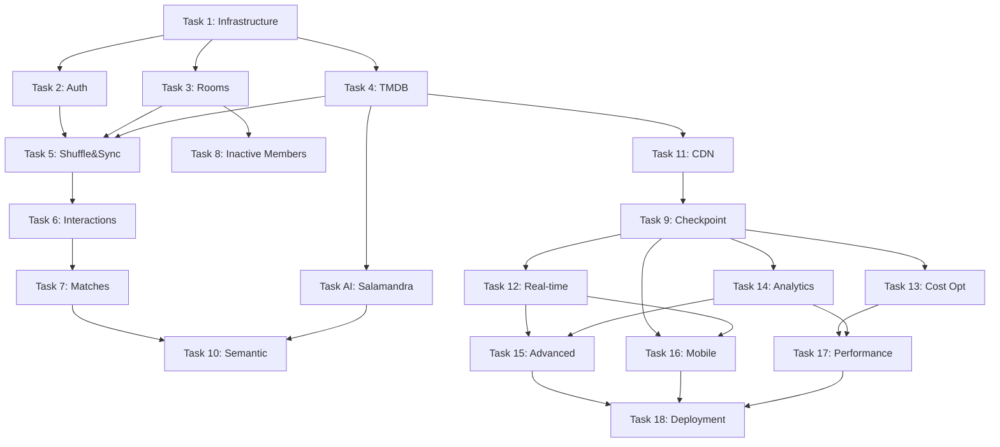

# Trinity MVP - Task Breakdown

## Task Status Overview

```
✅ Task 1: Infrastructure Base - COMPLETED
✅ Task 2: Authentication System - COMPLETED  
✅ Task 3: Room Management - COMPLETED
✅ Task 4: TMDB Integration - COMPLETED
✅ Task 5: Shuffle & Sync System - COMPLETED
✅ Task 6: Interaction System - COMPLETED
✅ Task 7: Match System - COMPLETED
✅ Task 8: Inactive Member Handling - COMPLETED
🧠 Task AI: Salamandra Integration - COMPLETED (BONUS)
❌ Task 9: Checkpoint & Validation - PENDING
✅ Task 10: Semantic Analysis - COMPLETED
🔄 Task 11: CDN & Image Optimization - IN PROGRESS
❌ Task 12: Real-time Synchronization - PENDING
❌ Task 13: Cost Optimization - PENDING
❌ Task 14: Analytics System - PENDING
🔄 Task 15: Advanced Room Features - IN PROGRESS
❌ Task 16: Mobile Application - PENDING
❌ Task 17: Performance Optimization - PENDING
❌ Task 18: Final Deployment - PENDING
```

**Progress: 10/18 tasks completed (56%) + AI Integration + CDN in progress**

---

## ✅ COMPLETED TASKS

### Task 1: Infrastructure Base ✅
**Status**: COMPLETED  
**Duration**: Foundation phase  

#### Deliverables Completed:
- [x] NestJS project setup with Clean Architecture
- [x] DynamoDB Multi-Table design (5 specialized tables)
- [x] AWS SDK configuration
- [x] Jest + fast-check testing framework
- [x] Swagger API documentation
- [x] GraphQL with AWS AppSync integration
- [x] AWS CDK infrastructure as code

#### Files Created:
- `backend/src/app.module.ts`
- `backend/src/infrastructure/database/`
- `infrastructure/lib/trinity-stack.ts`
- `infrastructure/lib/trinity-database-stack.ts`

### Task 2: Authentication System ✅
**Status**: COMPLETED  
**Duration**: 1 sprint  

#### Deliverables Completed:
- [x] AuthService with AWS Cognito integration
- [x] AuthController with REST endpoints
- [x] JWT Guards for endpoint protection
- [x] Property tests for authentication flows
- [x] User registration, login, refresh, logout
- [x] Profile management

#### API Endpoints:
- `POST /auth/register`
- `POST /auth/login`
- `POST /auth/refresh`
- `POST /auth/logout`
- `GET /auth/profile`

#### Files Created:
- `backend/src/modules/auth/`
- `backend/src/infrastructure/cognito/`
- `backend/src/modules/auth/auth.service.spec.ts`

### Task 3: Room Management ✅
**Status**: COMPLETED  
**Duration**: 1 sprint  

#### Deliverables Completed:
- [x] RoomService for room lifecycle management
- [x] MemberService for member management
- [x] RoomController with REST API
- [x] Property tests for room operations
- [x] Role-based permissions (admin, moderator, member)
- [x] Room states (active, paused, finished)

#### Features Implemented:
- Room creation and configuration
- Member invitation and management
- Role assignment and permissions
- Room status tracking
- Member activity monitoring

#### Files Created:
- `backend/src/modules/room/`
- `backend/src/domain/entities/room.entity.ts`
- `backend/src/modules/room/room.service.spec.ts`

### Task 4: TMDB Integration ✅
**Status**: COMPLETED  
**Duration**: 1 sprint  

#### Deliverables Completed:
- [x] TMDBService for external API integration
- [x] MediaService for content management
- [x] MediaController with REST endpoints
- [x] Circuit breaker for API resilience
- [x] Intelligent caching in DynamoDB
- [x] Rate limit handling

#### Features Implemented:
- Movie and TV show search
- Content details retrieval
- Image and metadata caching
- API failure handling
- Cache invalidation strategies

#### Files Created:
- `backend/src/infrastructure/tmdb/`
- `backend/src/modules/media/`
- `backend/src/infrastructure/circuit-breaker/`

### Task 5: Shuffle & Sync System ✅
**Status**: COMPLETED  
**Duration**: 1 sprint  

#### Deliverables Completed:
- [x] ShuffleSyncService with core algorithm
- [x] ShuffleSyncController with REST API
- [x] Property tests with 100+ iterations
- [x] Master list generation and management
- [x] Individual user list randomization
- [x] List regeneration capabilities

#### API Endpoints:
- `POST /rooms/:roomId/shuffle-sync/generate`
- `POST /rooms/:roomId/shuffle-sync/regenerate`
- `POST /rooms/:roomId/shuffle-sync/inject`
- `GET /rooms/:roomId/shuffle-sync/verify`
- `GET /rooms/:roomId/shuffle-sync/stats`

#### Files Created:
- `backend/src/modules/room/shuffle-sync.service.ts`
- `backend/src/modules/room/shuffle-sync.controller.ts`
- `backend/src/modules/room/shuffle-sync.service.spec.ts`

### Task 6: Interaction System ✅
**Status**: COMPLETED  
**Duration**: 1 sprint  

#### Deliverables Completed:
- [x] InteractionService for voting logic
- [x] InteractionController with REST API
- [x] VoteService for vote management
- [x] Property tests for interaction flows
- [x] Vote validation and duplicate prevention
- [x] Progress tracking and queue status

#### Features Implemented:
- Tinder-style swipe voting
- Vote recording with validation
- Duplicate vote prevention
- Progress tracking per member
- Queue status monitoring
- Session management

#### Files Created:
- `backend/src/modules/interaction/`
- `backend/src/domain/entities/interaction.entity.ts`
- `backend/src/modules/vote/`
- `backend/src/modules/interaction/interaction.service.spec.ts`

### Task 7: Match System ✅
**Status**: COMPLETED  
**Duration**: 1 sprint  

#### Deliverables Completed:
- [x] MatchService for consensus detection
- [x] MatchController with REST API
- [x] Property tests for match detection
- [x] Automatic unanimous consensus detection
- [x] Match creation and persistence
- [x] Match library with statistics

#### Features Implemented:
- Real-time consensus detection
- Match creation when all active members vote positively
- Match library and history
- Match statistics and summaries
- Notification system for matches

#### Files Created:
- `backend/src/modules/match/`
- `backend/src/domain/entities/match.entity.ts`
- `backend/src/modules/match/match.service.spec.ts`

### Task 8: Inactive Member Handling ✅
**Status**: COMPLETED  
**Duration**: 1 sprint  

#### Deliverables Completed:
- [x] InactiveMemberService for activity tracking
- [x] InactiveMemberController with REST API
- [x] Cron jobs for automated cleanup
- [x] Property tests for inactive member exclusion
- [x] Activity level classification
- [x] Configurable timeout settings

#### Features Implemented:
- Automatic activity level classification
- Exclusion from consensus calculations
- Configurable timeout settings
- Automatic and manual reactivation
- Activity statistics per room
- Scheduled cleanup jobs

#### Files Created:
- `backend/src/modules/room/inactive-member.service.ts`
- `backend/src/modules/room/inactive-member.controller.ts`
- `backend/src/modules/room/inactive-member.service.spec.ts`

### 🧠 Task AI: Salamandra Integration ✅
**Status**: COMPLETED (BONUS FEATURE)  
**Duration**: 1 sprint  

#### Deliverables Completed:
- [x] ALIAService for Salamandra AI integration
- [x] AIController with REST API
- [x] AIModule for AI functionality
- [x] Hugging Face Inference API client
- [x] Emotional state analysis
- [x] Genre-based recommendations

#### Features Implemented:
- Natural language emotional state analysis
- Genre recommendations based on mood
- Conversion to specific movie recommendations
- Fallback mechanisms for AI failures
- Health monitoring for AI service
- Integration with TMDB for movie conversion

#### API Endpoints:
- `POST /ai/chat-recommendations`
- `GET /ai/health`

#### GraphQL:
- `getChatRecommendations(userText: String!)`

#### Files Created:
- `backend/src/modules/ai/`
- `backend/SALAMANDRA_INTEGRATION.md`

### Task 10: Semantic Analysis ✅
**Status**: COMPLETED  
**Duration**: 1 sprint  

#### Deliverables Completed:
- [x] SemanticAnalysisService for preference analysis
- [x] SemanticAnalysisController with REST API
- [x] Property tests for semantic analysis
- [x] Preference pattern analysis from votes
- [x] Content similarity calculations
- [x] Smart content injection

#### Features Implemented:
- Analysis of voting patterns for preferences
- Content similarity using metadata vectors
- Bridge content identification
- Smart content injection maintaining randomization
- Preference-based content recommendations

#### API Endpoints:
- `POST /semantic/analyze-preferences`
- `POST /semantic/inject-content`
- `GET /semantic/similarity/:contentId`

#### Files Created:
- `backend/src/modules/semantic/`
- `backend/src/modules/semantic/semantic-analysis.service.spec.ts`

---

## 🔄 IN PROGRESS TASKS

### Task 11: CDN & Image Optimization 🔄
**Status**: IN PROGRESS  
**Current Phase**: Property test validation  
**Estimated Completion**: Next sprint  

#### Completed:
- [x] CDNService implementation
- [x] CDNController with 6 REST endpoints
- [x] Property test creation (`cdn.service.spec.ts`)
- [x] Integration with app.module.ts

#### In Progress:
- [ ] **Task 11.1**: Property test validation and fixes
- [ ] Test execution: `npm test -- --testPathPatterns="cdn.service.spec.ts"`
- [ ] Error correction if tests fail

#### Pending:
- [ ] AWS CloudFront configuration
- [ ] Environment variables setup
- [ ] Integration with MediaModule
- [ ] Performance benchmarking

#### API Endpoints:
- `POST /cdn/optimize-image`
- `POST /cdn/progressive-loading`
- `GET /cdn/cache-stats`
- `POST /cdn/invalidate-cache`
- `GET /cdn/image-info/:imagePath`

#### Next Steps:
1. Execute property tests and validate functionality
2. Fix any failing tests
3. Configure AWS CloudFront environment variables
4. Integrate CDN with existing media service
5. Mark Task 11 as completed

---

## ❌ PENDING TASKS

### Task 9: Checkpoint & Validation ❌
**Status**: PENDING  
**Priority**: HIGH (Should be next after Task 11.1)  
**Estimated Duration**: 0.5 sprint  

#### Objectives:
- [ ] Execute full test suite validation
- [ ] Fix any failing property tests
- [ ] Validate all 10 completed modules
- [ ] Performance benchmarking
- [ ] Code quality assessment

#### Acceptance Criteria:
- All unit tests pass (100% success rate)
- All property tests pass with 100+ iterations
- No critical code quality issues
- API response times < 200ms
- Memory usage within acceptable limits

#### Commands to Execute:
```bash
npm run test                    # Full test suite
npm run test:cov               # Coverage report
npm run build                  # Build validation
npm run start:dev              # Runtime validation
```

### Task 12: Real-time Synchronization ❌
**Status**: PENDING  
**Priority**: MEDIUM  
**Estimated Duration**: 2 sprints  

#### Objectives:
- [ ] WebSocket or Server-Sent Events implementation
- [ ] Real-time vote updates
- [ ] Live member status changes
- [ ] Instant match notifications
- [ ] Room state synchronization

#### Technical Requirements:
- WebSocket gateway with NestJS
- Redis for session management
- Event-driven architecture
- Connection state management
- Scalable real-time infrastructure

#### Deliverables:
- WebSocketGateway implementation
- Real-time event system
- Client connection management
- Event broadcasting service
- Integration tests for real-time features

### Task 13: Cost Optimization ❌
**Status**: PENDING  
**Priority**: MEDIUM  
**Estimated Duration**: 1 sprint  

#### Objectives:
- [ ] AWS cost analysis and optimization
- [ ] Lambda function optimization
- [ ] DynamoDB cost optimization
- [ ] Auto-scaling configuration
- [ ] Resource monitoring and alerting

#### Technical Requirements:
- AWS Cost Explorer integration
- Lambda cold start optimization
- DynamoDB on-demand vs provisioned analysis
- CloudWatch cost monitoring
- Automated scaling policies

### Task 14: Analytics System ❌
**Status**: PENDING  
**Priority**: MEDIUM  
**Estimated Duration**: 2 sprints  

#### Objectives:
- [ ] User behavior analytics
- [ ] Room performance metrics
- [ ] Content preference analysis
- [ ] Match success rate tracking
- [ ] Dashboard for insights

#### Technical Requirements:
- Analytics service implementation
- Data aggregation pipelines
- Metrics collection and storage
- Dashboard API endpoints
- Visualization data preparation

### Task 15: Advanced Room Features ❌
**Status**: PENDING  
**Priority**: LOW  
**Estimated Duration**: 2 sprints  

#### Objectives:
- [ ] Room templates and presets
- [ ] Advanced room settings
- [ ] Room scheduling
- [ ] Recurring room sessions
- [ ] Room analytics and insights

### Task 16: Mobile Application ❌
**Status**: PENDING  
**Priority**: HIGH (Post-backend completion)  
**Estimated Duration**: 4 sprints  

#### Objectives:
- [ ] React Native application development
- [ ] Native swipe gestures
- [ ] Push notifications
- [ ] Offline capabilities
- [ ] App store deployment

#### Current Status:
- Basic React Native project structure exists
- No implementation started
- Requires backend API completion first

### Task 17: Performance Optimization ❌
**Status**: PENDING  
**Priority**: MEDIUM  
**Estimated Duration**: 1 sprint  

#### Objectives:
- [ ] API response time optimization
- [ ] Database query optimization
- [ ] Caching strategy enhancement
- [ ] Load testing and optimization
- [ ] Memory usage optimization

### Task 18: Final Deployment ❌
**Status**: PENDING  
**Priority**: HIGH (Final phase)  
**Estimated Duration**: 1 sprint  

#### Objectives:
- [ ] Production environment setup
- [ ] CI/CD pipeline configuration
- [ ] Security hardening
- [ ] Monitoring and alerting setup
- [ ] Documentation finalization

---

## Task Dependencies



## Immediate Action Plan

### Next 2 Weeks (High Priority)
1. **Complete Task 11.1**: Validate CDN property tests
2. **Execute Task 9**: Run comprehensive checkpoint validation
3. **Fix any issues**: Address failing tests or performance problems
4. **Plan Task 12**: Design real-time synchronization architecture

### Next Month (Medium Priority)
1. **Implement Task 12**: Real-time synchronization
2. **Start Task 13**: Cost optimization analysis
3. **Begin Task 14**: Analytics system design
4. **Prepare Task 16**: Mobile application planning

### Next Quarter (Long-term)
1. **Complete backend features**: Tasks 12-15
2. **Develop mobile application**: Task 16
3. **Optimize performance**: Task 17
4. **Production deployment**: Task 18

## Success Metrics

### Technical Metrics
- **Test Coverage**: > 90% for all modules
- **Property Test Success**: 100% pass rate with 100+ iterations
- **API Response Time**: < 200ms average
- **Error Rate**: < 1% of requests
- **Uptime**: > 99.9% availability

### Feature Metrics
- **Room Creation Success**: > 95%
- **Match Detection Accuracy**: 100% for unanimous votes
- **AI Recommendation Response**: < 3s average
- **CDN Cache Hit Rate**: > 80%
- **User Session Duration**: Track and optimize

### Business Metrics
- **User Engagement**: Daily/weekly active users
- **Room Completion Rate**: Percentage of rooms finding matches
- **Content Discovery Rate**: New content discovered per session
- **User Retention**: Weekly/monthly retention rates

---

**Document Version**: 1.0  
**Last Updated**: December 24, 2024  
**Status**: Living document - updated as tasks progress  
**Next Review**: After Task 11.1 completion and checkpoint execution